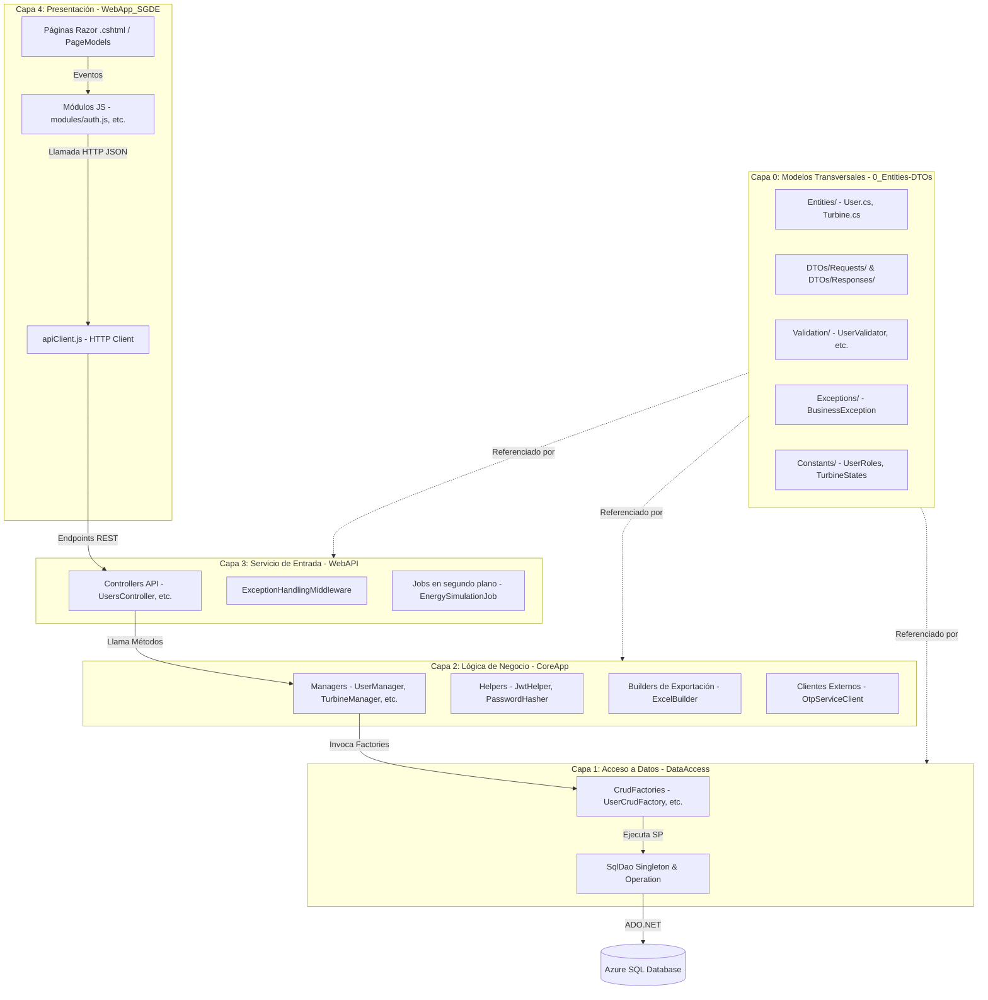

# Especificación Técnica de Arquitectura: Proyecto SGDE

Este documento proporciona una documentación técnica exhaustiva y detallada de la arquitectura del **Sistema de Generación y Despacho Eléctrico (SGDE)**. Su objetivo es servir como referencia de diseño y auditoría técnica para la implementación del sistema, mapeando las relaciones entre capas, el ciclo de vida de los datos, la separación de responsabilidades y la trazabilidad de cada una de las 24 entidades y sus respectivos DTOs.

---

## 1. Mapeo de la Arquitectura del Sistema (5 Capas)

El sistema está organizado en una arquitectura desacoplada de 5 capas (`0_` a `4_`), donde la comunicación entre la base de datos y la interfaz de usuario fluye a través de contratos específicos.



---

## 2. Inventario de Archivos por Capa y Entidades

A continuación se muestra el árbol de directorios que detalla la ubicación de cada uno de los archivos del proyecto por capa funcional:

```text
0_Entities-DTOs/
├── BaseDTO.cs
├── Constants/
│   ├── UserRoles.cs
│   ├── UserStates.cs
│   ├── OtpUsageTypes.cs
│   ├── OtpAttemptStates.cs
│   ├── TurbineStates.cs
│   ├── MaintenanceTypes.cs
│   ├── MaintenanceStates.cs
│   ├── FailureSeverities.cs
│   ├── EnergyLossCauses.cs
│   ├── FlushTypes.cs
│   ├── FlushStates.cs
│   ├── ForecastStates.cs
│   ├── DistributionScenarios.cs
│   ├── StatementStates.cs
│   ├── MovementTypes.cs
│   ├── AuditModules.cs
│   ├── AuditActions.cs
│   ├── NotificationTypes.cs
│   ├── NotificationStates.cs
│   ├── ExportFormats.cs
│   └── SystemActor.cs
├── DTOs/
│   ├── ApiResponse.cs
│   ├── PagedRequest.cs
│   ├── PagedResponse.cs
│   ├── Requests/
│   │   ├── RegisterBuyerRequest.cs
│   │   ├── CreateInternalUserRequest.cs
│   │   ├── UpdateUserRequest.cs
│   │   ├── UpdateProfileRequest.cs
│   │   ├── LoginStep1Request.cs
│   │   ├── LoginStep2Request.cs
│   │   ├── ActivateAccountRequest.cs
│   │   ├── RecoverPasswordRequest.cs
│   │   ├── ResetPasswordRequest.cs
│   │   ├── ResendOtpRequest.cs
│   │   ├── DeactivateUserRequest.cs
│   │   ├── RegisterTurbineRequest.cs
│   │   ├── UpdateTurbineRequest.cs
│   │   ├── ChangeTurbineStateRequest.cs
│   │   ├── RegisterMaintenanceRequest.cs
│   │   ├── CompleteMaintenanceRequest.cs
│   │   ├── RegisterFailureRequest.cs
│   │   ├── RegisterForecastRequest.cs
│   │   ├── ModifyForecastRequest.cs
│   │   ├── SetPriceRequest.cs
│   │   ├── SetTaxRequest.cs
│   │   ├── AnnulStatementRequest.cs
│   │   ├── RegenerateStatementRequest.cs
│   │   ├── ExportStatementRequest.cs
│   │   ├── SetManualCapacityRequest.cs
│   │   ├── SetBatteryChargeRequest.cs
│   │   └── UpdateFlushConfigRequest.cs
│   └── Responses/
│       ├── LoginResponse.cs
│       ├── UserSafeResponse.cs
│       ├── TurbineMetricsResponse.cs
│       ├── TurbineHistoryResponse.cs
│       ├── DashboardAdminResponse.cs
│       ├── DashboardOperationsResponse.cs
│       └── DashboardBuyerResponse.cs
├── Exceptions/
│   ├── BusinessException.cs
│   ├── ValidationException.cs
│   ├── NotFoundException.cs
│   └── UnauthorizedAccessAppException.cs
├── Validation/
│   ├── ValidationResult.cs
│   ├── UserValidator.cs
│   ├── TurbineValidator.cs
│   ├── MaintenanceValidator.cs
│   ├── ForecastValidator.cs
│   └── BillingValidator.cs
├── Helpers/
│   ├── TimeHelper.cs
│   └── StateTransition.cs
└── Entities/
    ├── User.cs
    ├── OtpAttempt.cs
    ├── Turbine.cs
    ├── TurbineStateHistory.cs
    ├── LocalBattery.cs
    ├── Maintenance.cs
    ├── Failure.cs
    ├── EnergyGenerationLog.cs
    ├── EnergyLossLog.cs
    ├── FlushConfig.cs
    ├── Flush.cs
    ├── FlushSnapshot.cs
    ├── SaturationLog.cs
    ├── CentralBank.cs
    ├── CentralBankLog.cs
    ├── Forecast.cs
    ├── CommercialDistribution.cs
    ├── DistributionDetail.cs
    ├── Price.cs
    ├── Tax.cs
    ├── AccountStatement.cs
    ├── NotificationQueue.cs
    ├── AuditLog.cs
    └── ExportLog.cs

1_DataAccess/
├── DAO/
│   ├── SqlDao.cs
│   └── Operation.cs
└── CRUD/
    ├── CrudFactory.cs
    ├── UserCrudFactory.cs
    ├── OtpAttemptCrudFactory.cs
    ├── TurbineCrudFactory.cs
    ├── TurbineStateHistoryCrudFactory.cs
    ├── LocalBatteryCrudFactory.cs
    ├── MaintenanceCrudFactory.cs
    ├── FailureCrudFactory.cs
    ├── EnergyGenerationLogCrudFactory.cs
    ├── EnergyLossLogCrudFactory.cs
    ├── FlushConfigCrudFactory.cs
    ├── FlushCrudFactory.cs
    ├── FlushSnapshotCrudFactory.cs
    ├── SaturationLogCrudFactory.cs
    ├── CentralBankCrudFactory.cs
    ├── CentralBankLogCrudFactory.cs
    ├── ForecastCrudFactory.cs
    ├── CommercialDistributionCrudFactory.cs
    ├── DistributionDetailCrudFactory.cs
    ├── PriceCrudFactory.cs
    ├── TaxCrudFactory.cs
    ├── AccountStatementCrudFactory.cs
    ├── NotificationQueueCrudFactory.cs
    ├── AuditLogCrudFactory.cs
    └── ExportLogCrudFactory.cs

2_CoreApp/
├── Helpers/
│   ├── JwtHelper.cs
│   └── PasswordHasher.cs
├── External/
│   └── OtpServiceClient.cs
├── Export/
│   ├── CsvBuilder.cs
│   ├── ExcelBuilder.cs
│   └── HtmlStatementBuilder.cs
└── Managers/
    ├── UserManager.cs
    ├── TurbineManager.cs
    ├── MaintenanceManager.cs
    ├── FailureManager.cs
    ├── EnergyManager.cs
    ├── FlushManager.cs
    ├── CentralBankManager.cs
    ├── ForecastManager.cs
    ├── DistributionManager.cs
    ├── BillingManager.cs
    ├── NotificationManager.cs
    ├── AuditManager.cs
    └── DashboardManager.cs

3_WebAPI/
├── BackgroundServices/
│   ├── JobBase.cs
│   ├── EnergySimulationJob.cs
│   ├── NightlyOrchestratorJob.cs
│   ├── MaintenanceCheckJob.cs
│   ├── NotificationProcessorJob.cs
│   └── AuditArchiveJob.cs
├── Middleware/
│   └── ExceptionHandlingMiddleware.cs
├── Controllers/
│   ├── UsersController.cs
│   ├── TurbinesController.cs
│   ├── MaintenancesController.cs
│   ├── FailuresController.cs
│   ├── EnergyController.cs
│   ├── FlushController.cs
│   ├── CentralBankController.cs
│   ├── ForecastsController.cs
│   ├── DistributionController.cs
│   ├── BillingController.cs
│   ├── AuditController.cs
│   └── DashboardController.cs
├── appsettings.json
└── Program.cs

4_WebApp/
├── wwwroot/
│   ├── css/
│   │   ├── site.css
│   │   └── theme.css
│   ├── js/
│   │   ├── apiClient.js
│   │   ├── session.js
│   │   ├── notifications.js
│   │   ├── theme.js
│   │   ├── site.js
│   │   └── modules/
│   │       ├── auth.js
│   │       ├── users.js
│   │       ├── turbines.js
│   │       ├── maintenances.js
│   │       ├── failures.js
│   │       ├── energy.js
│   │       ├── flush.js
│   │       ├── central-bank.js
│   │       ├── forecasts.js
│   │       ├── billing.js
│   │       └── audit.js
└── Pages/
    ├── Index.cshtml
    ├── Login.cshtml
    ├── LoginOtp.cshtml
    ├── Register.cshtml
    ├── Activate.cshtml
    ├── RecoverPassword.cshtml
    ├── ResetPassword.cshtml
    ├── AccessDenied.cshtml
    ├── Admin/
    │   ├── Dashboard.cshtml
    │   ├── Users.cshtml
    │   ├── Turbines.cshtml
    │   ├── TurbineDetail.cshtml
    │   ├── Flush.cshtml
    │   ├── CentralBank.cshtml
    │   ├── Forecasts.cshtml
    │   ├── Distribution.cshtml
    │   ├── Prices.cshtml
    │   ├── Taxes.cshtml
    │   ├── Statements.cshtml
    │   ├── Audit.cshtml
    │   └── Exports.cshtml
    ├── Engineer/
    │   ├── Dashboard.cshtml
    │   ├── Turbines.cshtml
    │   ├── TurbineDetail.cshtml
    │   ├── Maintenances.cshtml
    │   ├── Failures.cshtml
    │   ├── Energy.cshtml
    │   ├── CentralBank.cshtml
    │   ├── FlushHistory.cshtml
    │   └── Audit.cshtml
    ├── Buyer/
    │   ├── Dashboard.cshtml
    │   ├── Forecasts.cshtml
    │   ├── Statements.cshtml
    │   ├── Distributions.cshtml
    │   └── Profile.cshtml
    └── Shared/
        ├── _Layout.cshtml
        ├── _LayoutPublic.cshtml
        ├── _Navbar.cshtml
        └── _ValidationScriptsPartial.cshtml
```

---

## 3. Relación y Mapeo: Entidades vs. DTOs

En el diseño técnico de SGDE, se evita el acoplamiento directo entre la persistencia (base de datos) y la comunicación externa (API REST) mediante la división estricta de responsabilidades en **Capa 0 (Entities-DTOs)**:

1.  **Entidades (`Entities/`)**: Son representaciones fuertemente tipadas de las tablas relacionales de la base de datos (ej: `User`, `Turbine`, `Maintenance`). Heredan de `BaseDTO` y mapean de forma exacta las columnas físicas. Solo son instanciadas por la capa de acceso a datos (`1_DataAccess`) y la lógica de negocio (`2_CoreApp`).
2.  **DTOs de Solicitud (`DTOs/Requests/`)**: Clases planas que contienen solo los datos estrictamente necesarios que el cliente frontend debe enviar para ejecutar una acción (ej: `RegisterBuyerRequest`). No contienen campos de auditoría ni ids autogenerados.
3.  **DTOs de Respuesta (`DTOs/Responses/`)**: Clases planas de solo-lectura seguras para transmisión (ej: `UserSafeResponse`). Ocultan información confidencial (como contraseñas o hashes) e incluyen propiedades de valor agregado calculadas en tiempo de ejecución (como `Age`).

### Flujo de Transformación y Mapeo
*   **Escritura (Request $\rightarrow$ Entidad $\rightarrow$ DB)**:
    1. El controlador recibe un JSON que des-serializa a un DTO de Request (ej: `CreateInternalUserRequest`).
    2. El Manager en `CoreApp` invoca el validador estático (ej: `UserValidator.Validate`) y arroja una excepción si los parámetros fallan.
    3. Si es válido, el Manager crea una instancia de la Entidad (ej: `User`), mapeando los campos del Request e inyectando valores del sistema (como un GUID autogenerado para `UserCode` o el hash de la contraseña mediante `PasswordHasher`).
    4. La Entidad es enviada a la `UserCrudFactory`, que la deconstruye en parámetros y ejecuta el stored procedure `CRE_USER_PR`.
*   **Lectura (DB $\rightarrow$ Entidad $\rightarrow$ Response)**:
    1. La factoría ejecuta un stored procedure de consulta y retorna un conjunto de diccionarios `Dictionary<string, object>` representativos de cada fila.
    2. El método `Build[Entidad]` lee la fila tipada y construye la Entidad.
    3. El Manager en `CoreApp` proyecta (mediante LINQ u operaciones directas) la Entidad hacia un DTO de respuesta seguro (ej: `UserSafeResponse`), el cual es devuelto finalmente al cliente envuelto en un objeto `ApiResponse`.

---

## 4. Ejemplos de Implementación de Clases Reales en el Proyecto

A continuación, se detalla la implementación exacta en C# de los módulos principales del proyecto para documentar la estructura de sus archivos `.cs`.

### Módulo de Usuario (`User`)

#### Entidad: `0_Entities-DTOs/Entities/User.cs`
```csharp
namespace SEGEDE_Grupo1.EntitiesDTOs.Entities;

using System;

public class User : BaseDTO
{
    public string Identification { get; set; } = string.Empty;
    public string FirstName { get; set; } = string.Empty;
    public string LastName { get; set; } = string.Empty;
    public DateTime BirthDate { get; set; }
    public string Phone { get; set; } = string.Empty;
    public string Email { get; set; } = string.Empty;
    public string? PhotoUrl { get; set; }
    public string PasswordHash { get; set; } = string.Empty;
    public string Role { get; set; } = string.Empty;
    public string Status { get; set; } = string.Empty;
    public int FailedAttempts { get; set; }
    public DateTime? BlockedAt { get; set; }
}
```

#### DTO de Solicitud de Registro Interno: `0_Entities-DTOs/DTOs/Requests/CreateInternalUserRequest.cs`
```csharp
namespace SEGEDE_Grupo1.EntitiesDTOs.DTOs.Requests;

using System;

public class CreateInternalUserRequest
{
    public string Identification { get; set; } = string.Empty;
    public string FirstName { get; set; } = string.Empty;
    public string LastName { get; set; } = string.Empty;
    public DateTime BirthDate { get; set; }
    public string Phone { get; set; } = string.Empty;
    public string Email { get; set; } = string.Empty;
    public string Password { get; set; } = string.Empty;
    public string Role { get; set; } = string.Empty;
}
```

#### DTO de Respuesta Segura: `0_Entities-DTOs/DTOs/Responses/UserSafeResponse.cs`
```csharp
namespace SEGEDE_Grupo1.EntitiesDTOs.DTOs.Responses;

using System;

public class UserSafeResponse
{
    public int Id { get; set; }
    public string Identification { get; set; } = string.Empty;
    public string FirstName { get; set; } = string.Empty;
    public string LastName { get; set; } = string.Empty;
    public string Email { get; set; } = string.Empty;
    public string Phone { get; set; } = string.Empty;
    public string? PhotoUrl { get; set; }
    public string Role { get; set; } = string.Empty;
    public string Status { get; set; } = string.Empty;
    public DateTime BirthDate { get; set; }
    public int Age { get; set; }
    public DateTime Created { get; set; }
}
```

#### Validador Técnico: `0_Entities-DTOs/Validation/UserValidator.cs`
```csharp
namespace SEGEDE_Grupo1.EntitiesDTOs.Validation;

using System;
using System.Text.RegularExpressions;

public static class UserValidator
{
    private static readonly Regex EmailRegex = new(@"^[^@\s]+@[^@\s]+\.[^@\s]+$", RegexOptions.Compiled);
    private static readonly Regex PasswordRegex = new(@"^(?=.*[a-z])(?=.*[A-Z])(?=.*\d)(?=.*[\W_]).{8,}$", RegexOptions.Compiled);
    private static readonly Regex PhoneRegex = new(@"^(\+506)?\d{8}$", RegexOptions.Compiled);
    private static readonly Regex DigitsOnly = new(@"^\d+$", RegexOptions.Compiled);

    public static ValidationResult Validate(
        string? email, string? identification, string? password,
        string? phone, DateTime? birthDate, string? firstName, string? lastName)
    {
        var result = new ValidationResult();

        if (string.IsNullOrWhiteSpace(email) || !EmailRegex.IsMatch(email))
            result.Add("El correo electrónico tiene un formato inválido.");

        if (string.IsNullOrWhiteSpace(identification) || !DigitsOnly.IsMatch(identification) || identification.Length < 9)
            result.Add("La identificación debe ser numérica y poseer el formato correcto.");

        if (string.IsNullOrWhiteSpace(password) || !PasswordRegex.IsMatch(password))
            result.Add("La contraseña debe poseer al menos 8 caracteres, incluyendo mayúsculas, minúsculas, números y caracteres especiales.");

        if (string.IsNullOrWhiteSpace(phone) || !PhoneRegex.IsMatch(phone))
            result.Add("El teléfono debe poseer 8 dígitos.");

        if (birthDate.HasValue)
        {
            int age = DateTime.Today.Year - birthDate.Value.Year;
            if (birthDate.Value.Date > DateTime.Today.AddYears(-age)) age--;
            if (age < 18)
                result.Add("El usuario debe ser mayor de 18 años.");
        }

        return result;
    }
}
```

#### Capa de Lógica de Negocio (Manager): `2_CoreApp/Managers/UserManager.cs` (Sección de Registro)
```csharp
namespace SEGEDE_Grupo1.CoreApp.Managers;

using System;
using System.Linq;
using SEGEDE_Grupo1.CoreApp.Helpers;
using SEGEDE_Grupo1.DataAccess.CRUD;
using SEGEDE_Grupo1.EntitiesDTOs.Entities;
using SEGEDE_Grupo1.EntitiesDTOs.DTOs.Requests;
using SEGEDE_Grupo1.EntitiesDTOs.DTOs.Responses;
using SEGEDE_Grupo1.EntitiesDTOs.Validation;
using SEGEDE_Grupo1.EntitiesDTOs.Exceptions;

public class UserManager
{
    private readonly UserCrudFactory _userCrudFactory = new();

    public void Register(RegisterBuyerRequest r)
    {
        var validation = UserValidator.Validate(r.Email, r.Identification, r.Password, r.Phone, r.BirthDate, r.FirstName, r.LastName);
        validation.ThrowIfInvalid();

        var existingUser = _userCrudFactory.RetrieveByEmail(r.Email);
        if (existingUser != null)
        {
            throw new BusinessException("La cuenta de correo electrónico ya está registrada.", "EMAIL_ALREADY_EXISTS");
        }

        string passwordHash = PasswordHasher.Hash(r.Password);

        var user = new User
        {
            Identification = r.Identification,
            FirstName = r.FirstName,
            LastName = r.LastName,
            BirthDate = r.BirthDate,
            Phone = r.Phone,
            Email = r.Email,
            PhotoUrl = r.PhotoUrl,
            PasswordHash = passwordHash,
            Role = "Buyer",
            Status = "PendingActivation",
            FailedAttempts = 0,
            Created = DateTime.Now
        };

        _userCrudFactory.Create(user);
    }
}
```

---

### Módulo de Planta y Operaciones (`Turbine`)

#### Entidad: `0_Entities-DTOs/Entities/Turbine.cs`
```csharp
namespace SEGEDE_Grupo1.EntitiesDTOs.Entities;

using System;

public class Turbine : BaseDTO
{
    public string UniqueCode { get; set; } = string.Empty;
    public string Name { get; set; } = string.Empty;
    public string Location { get; set; } = string.Empty;
    public string Brand { get; set; } = string.Empty;
    public string Model { get; set; } = string.Empty;
    public int Year { get; set; }
    public decimal WeeklyNominalCapacity { get; set; }
    public string Status { get; set; } = string.Empty;
    public DateTime? LastMaintenance { get; set; }
    public DateTime LastStateChange { get; set; }
}
```

#### DTO de Solicitud de Registro: `0_Entities-DTOs/DTOs/Requests/RegisterTurbineRequest.cs`
```csharp
namespace SEGEDE_Grupo1.EntitiesDTOs.DTOs.Requests;

public class RegisterTurbineRequest
{
    public string UniqueCode { get; set; } = string.Empty;
    public string Name { get; set; } = string.Empty;
    public string Location { get; set; } = string.Empty;
    public string Brand { get; set; } = string.Empty;
    public string Model { get; set; } = string.Empty;
    public int Year { get; set; }
    public decimal WeeklyNominalCapacity { get; set; }
}
```

#### DTO de Respuesta de Métricas: `0_Entities-DTOs/DTOs/Responses/TurbineMetricsResponse.cs`
```csharp
namespace SEGEDE_Grupo1.EntitiesDTOs.DTOs.Responses;

public class TurbineMetricsResponse
{
    public int TurbineId { get; set; }
    public decimal TotalActiveSeconds { get; set; }
    public decimal TotalInactiveSeconds { get; set; }
    public decimal TotalSeconds { get; set; }
    public decimal OperationalAvailability { get; set; }
    public decimal OperationalUnavailability { get; set; }
    public int TotalFailures { get; set; }
    public int TotalMaintenances { get; set; }
    public decimal MTBF { get; set; }
    public decimal MTTR { get; set; }
}
```

#### CRUD Factory: `1_DataAccess/CRUD/TurbineCrudFactory.cs`
```csharp
namespace SEGEDE_Grupo1.DataAccess.CRUD;

using System;
using System.Collections.Generic;
using SEGEDE_Grupo1.DataAccess.DAO;
using SEGEDE_Grupo1.EntitiesDTOs;
using SEGEDE_Grupo1.EntitiesDTOs.Entities;

public class TurbineCrudFactory : CrudFactory
{
    public override void Create(BaseDTO baseDTO)
    {
        var turbine = (Turbine)baseDTO;
        var op = new Operation { ProcedureName = "CRE_TURBINE_PR" };
        op.AddStringParameter("@UniqueCode", turbine.UniqueCode);
        op.AddStringParameter("@Name", turbine.Name);
        op.AddStringParameter("@Location", turbine.Location);
        op.AddStringParameter("@Brand", turbine.Brand);
        op.AddStringParameter("@Model", turbine.Model);
        op.AddIntParameter("@Year", turbine.Year);
        op.AddDecimalParameter("@WeeklyNominalCapacity", turbine.WeeklyNominalCapacity);
        op.AddStringParameter("@Status", turbine.Status);
        op.AddDateTimeParameter("@Created", turbine.Created);
        sqlDao.ExecuteProcedure(op);
    }

    public override List<T> RetrieveAll<T>()
    {
        var op = new Operation { ProcedureName = "RET_ALL_TURBINE_PR" };
        var results = sqlDao.ExecuteQueryProcedure(op);
        return results.Select(r => (T)(object)new Turbine
        {
            Id = (int)r["Id"],
            UniqueCode = (string)r["UniqueCode"],
            Name = (string)r["Name"],
            Location = (string)r["Location"],
            Brand = (string)r["Brand"],
            Model = (string)r["Model"],
            Year = (int)r["Year"],
            WeeklyNominalCapacity = (decimal)r["WeeklyNominalCapacity"],
            Status = (string)r["Status"],
            LastMaintenance = r["LastMaintenance"] as DateTime?,
            LastStateChange = (DateTime)r["LastStateChange"],
            Created = (DateTime)r["Created"],
            Updated = r["Updated"] as DateTime? ?? default
        }).ToList();
    }

    // Métodos de lectura por ID, actualización y eliminación lógica omitidos...
}
```

---

## 5. Beneficios Técnicos del Diseño del Proyecto

1.  **Protección de Datos Sensibles**: La API REST expone de forma directa clases como `UserSafeResponse`, previniendo que atributos confidenciales tales como el `PasswordHash` o los intentos fallidos de autenticación (`FailedAttempts`) viajen hacia el navegador del cliente.
2.  **Validaciones Cohesivas y Desacopladas**: Los validadores de dominio (como `UserValidator`) son estáticos y auto-contenidos en la **Capa 0**, permitiendo validar la integridad de los datos antes de instanciar o procesar entidades.
3.  **Trazabilidad y Mantenimiento Directo**: La correspondencia ordenada de carpetas por cada entidad dentro de los proyectos del Backend simplifica la detección y edición de flujos de datos. Si se requiere agregar o modificar campos de un dominio (ej: `Turbine`), se editan de forma directa los archivos localizados dentro del directorio `/Turbine` de la solución.
