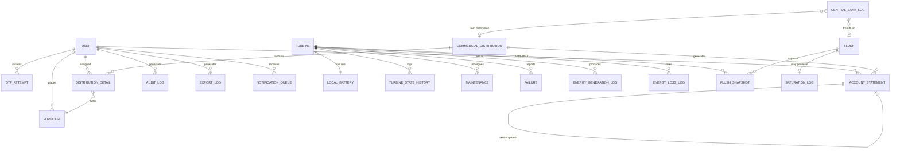

# SGDE — Documento de Diseño Técnico Completo (Backend + Frontend)

**Sistema de Generación y Despacho Eléctrico**  
CoreForge Technologies | BISOFT-13 — Ingeniería del Software 2  
.NET 10 | ASP.NET Core Web API + Razor Pages | Azure SQL Database | Junio 2026

> **Documento único y autocontenido.** Cubre las 5 capas del sistema: las 4 del
> backend N-Tier (Entities, DataAccess, CoreApp, WebAPI) más la capa de
> presentación Razor Pages. Todo el **código está en inglés** (entidades,
> propiedades, constantes, Stored Procedures, JavaScript), alineado con el
> schema SQL. El texto explicativo está en español.

---

## Tabla de Contenidos

**Parte I — Fundamentos**
0. Decisiones de Arquitectura Confirmadas
1. Estructura de la Solución y Layout de Archivos
2. Stack y Restricciones Globales

**Parte II — Backend Capa 0 (Entities-DTOs)**
3. Fundamentos (BaseDTO, SystemActor, ApiResponse, Pagination)
4. Constantes de Dominio
5. Excepciones de Dominio
6. Validación
7. Helpers (TimeHelper, StateTransition)
8. DTOs de Request y Response
9. Catálogo Completo de Entidades
10. Diagrama Entidad-Relación

**Parte III — Backend Capas 1-3**
11. Capa 1 — Infraestructura de Datos
12. Capa 1 — CrudFactories y Stored Procedures
13. Capa 2 — Helpers y Cliente Externo
14. Capa 2 — Managers y Métodos
15. Capa 3 — Configuración Web
16. Capa 3 — Controllers y Endpoints

**Parte IV — Procesos y Operación Backend**
17. Procesos Transversales (Flush, Distribución, Jobs, WORM, Auditoría)
18. Configuración de Despliegue
19. Integración OTP Externo
20. Funcionalidades de Soporte

**Parte V — Frontend (Razor Pages)**
21. Rol de la Capa de Presentación
22. Estructura del Proyecto WebApp
23. Patrón de Página Razor
24. Infraestructura JavaScript Compartida
25. Autenticación y Sesión en Cliente
26. Control de Acceso por Rol
27. Inventario Completo de Páginas por Rol
28. Detalle de Páginas por Rol
29. Componentes Compartidos, API Contract, Accesibilidad

**Parte VI — Cierre**
30. Matriz de Trazabilidad RF → Implementación
31. Datos Iniciales (Seeds)
32. Puntos Abiertos
33. Checklist de Implementación

---

# PARTE I — FUNDAMENTOS

## 0. Decisiones de Arquitectura Confirmadas

| # | Decisión | Detalle |
|---|---|---|
| D-01 | Frontend | Proyecto Razor Pages separado (`WebApp_SGDE`), cliente de la Web API. Bootstrap 5 + jQuery + DataTables. Molde estructural: CenfoCinemas (solo la forma). |
| D-02 | Base de datos | **Azure SQL Database**. Connection string vía configuración/Key Vault. |
| D-03 | OTP | **API externo de terceros**. El SGDE delega generación, envío y verificación; controla localmente reenvíos, fallos y bloqueo. |
| D-04 | Idioma del código | **Inglés sin excepciones** (entidades, propiedades, constantes, SPs, JS). Texto explicativo en español. |
| D-05 | Dashboard freshness | **Pendiente de definir** (§32). No bloquea el resto del diseño. |
| D-06 | Resto de decisiones | Resueltas con criterio profesional en este documento. |

---

## 1. Estructura de la Solución y Layout de Archivos

### 1.1 Proyectos y referencias

```
SGDE.sln
├── 0_Entities-DTOs/        ← Class Library (.NET 10)
├── 1_DataAccess/           ← Class Library (.NET 10)
├── 2_CoreApp/              ← Class Library (.NET 10)
├── 3_WebAPI/               ← ASP.NET Core Web API (.NET 10)
└── WebApp_SGDE/            ← ASP.NET Core Razor Pages (.NET 10)
```

| Proyecto | Referencia a |
|---|---|
| `0_Entities-DTOs` | *(ninguna)* |
| `1_DataAccess` | `0_Entities-DTOs` |
| `2_CoreApp` | `0_Entities-DTOs`, `1_DataAccess` |
| `3_WebAPI` | `0_Entities-DTOs`, `2_CoreApp` |
| `WebApp_SGDE` | *(ninguna — consume la API por HTTP)* |

### 1.2 NuGet packages

| Proyecto | Package | Uso |
|---|---|---|
| `1_DataAccess` | `Microsoft.Data.SqlClient` | Acceso a Azure SQL |
| `2_CoreApp` | `System.IdentityModel.Tokens.Jwt` | Generación/validación JWT |
| `2_CoreApp` | `BCrypt.Net-Next` | Hash de contraseñas (RNF-001) |
| `3_WebAPI` | `Microsoft.AspNetCore.OpenApi` | Swagger |
| `3_WebAPI` | `Swashbuckle.AspNetCore` | Swagger UI |
| `3_WebAPI` | `Microsoft.AspNetCore.Authentication.JwtBearer` | Middleware auth |
| `WebApp_SGDE` | *(solo librerías cliente en wwwroot: Bootstrap, jQuery, DataTables)* | UI |

### 1.3 Layout de archivos — Backend

```
0_Entities-DTOs/
├── BaseDTO.cs
├── Constants/
│   ├── UserRoles.cs
│   ├── UserStates.cs
│   ├── OtpUsageTypes.cs
│   ├── OtpAttemptStates.cs
│   ├── TurbineStates.cs
│   ├── MaintenanceTypes.cs
│   ├── MaintenanceStates.cs
│   ├── FailureSeverities.cs
│   ├── EnergyLossCauses.cs
│   ├── FlushTypes.cs
│   ├── FlushStates.cs
│   ├── ForecastStates.cs
│   ├── DistributionScenarios.cs
│   ├── StatementStates.cs
│   ├── MovementTypes.cs
│   ├── AuditModules.cs
│   ├── AuditActions.cs
│   ├── NotificationTypes.cs
│   ├── NotificationStates.cs
│   ├── ExportFormats.cs
│   └── SystemActor.cs
├── DTOs/
│   ├── ApiResponse.cs
│   ├── PagedRequest.cs
│   ├── PagedResponse.cs
│   ├── Requests/   (26 request DTOs — ver §8.1)
│   └── Responses/  (7 response DTOs — ver §8.2)
├── Exceptions/
│   ├── BusinessException.cs
│   ├── ValidationException.cs
│   ├── NotFoundException.cs
│   └── UnauthorizedAccessAppException.cs
├── Validation/
│   ├── ValidationResult.cs
│   ├── UserValidator.cs
│   ├── TurbineValidator.cs
│   ├── MaintenanceValidator.cs
│   ├── ForecastValidator.cs
│   └── BillingValidator.cs
├── Helpers/
│   ├── TimeHelper.cs
│   └── StateTransition.cs
└── Entities/   (24 entidades — ver §9)

1_DataAccess/
├── DAO/
│   ├── SqlDao.cs
│   └── Operation.cs
└── CRUD/
    ├── CrudFactory.cs
    └── (24 factories — ver §12)

2_CoreApp/
├── Helpers/
│   ├── JwtHelper.cs
│   └── PasswordHasher.cs
├── External/
│   └── OtpServiceClient.cs
├── Export/
│   ├── CsvBuilder.cs
│   ├── ExcelBuilder.cs
│   └── HtmlStatementBuilder.cs
└── (13 managers — ver §14)

3_WebAPI/
├── BackgroundServices/
│   ├── JobBase.cs
│   ├── EnergySimulationJob.cs
│   ├── NightlyOrchestratorJob.cs
│   ├── MaintenanceCheckJob.cs
│   ├── NotificationProcessorJob.cs
│   └── AuditArchiveJob.cs
├── Middleware/
│   └── ExceptionHandlingMiddleware.cs
├── Controllers/   (12 controllers — ver §16)
├── appsettings.json
└── Program.cs
```

### 1.4 Layout de archivos — Frontend

Resumen (el árbol completo, archivo por archivo, está en §22):

```
WebApp_SGDE/
├── Pages/
│   ├── (8 públicas)   Index, Login, LoginOtp, Register, Activate,
│   │                  RecoverPassword, ResetPassword, AccessDenied
│   ├── Admin/         (15) Dashboard, Users, Turbines, TurbineDetail, Flush,
│   │                  CentralBank, Forecasts, Distribution, Prices, Taxes,
│   │                  Statements, Audit, Exports
│   ├── Engineer/      (9)  Dashboard, Turbines, TurbineDetail, Maintenances,
│   │                  Failures, Energy, CentralBank, FlushHistory, Audit
│   ├── Buyer/         (5)  Dashboard, Forecasts, Statements, Distributions,
│   │                  Profile
│   └── Shared/        _Layout, _LayoutPublic, _Navbar,
│                      _ValidationScriptsPartial
├── wwwroot/
│   ├── css/           site.css, theme.css
│   ├── js/            apiClient.js, session.js, notifications.js,
│   │   │              theme.js, site.js
│   │   └── pages-controller/   (27 ViewControllers — lista completa en §22)
│   └── lib/           bootstrap, jquery, datatables, bootstrap-icons
├── appsettings.json   (ApiBaseUrl)
├── launchSettings.json
└── Program.cs
```

Cada página = par `.cshtml` + `.cshtml.cs`. Cada página interactiva tiene su
`ViewController.js`; algunos se comparten entre roles con flags (detalle §22.1).

---

## 2. Stack y Restricciones Globales

| Parámetro | Valor |
|---|---|
| Framework | .NET 10 |
| Base de datos | Azure SQL Database |
| Acceso a datos | Stored Procedures vía `Microsoft.Data.SqlClient` |
| ORM | Ninguno (prohibido) |
| IoC para factories/managers | Prohibido — instanciación directa `new()` |
| Precisión decimal | `DECIMAL(18,4)` en SQL / `decimal` en C# |
| Zona horaria | `America/Costa_Rica` en todos los timestamps |
| Moneda | CRC |
| Unidad energía | MWh (interno); kWh solo visualización |
| Auth | JWT Bearer |
| OTP | Servicio externo (§19) |
| Hash contraseñas | BCrypt, work factor 12 |
| **Idioma del código** | **Inglés sin excepciones** |
| Frontend | Razor Pages + Bootstrap 5 + jQuery + DataTables |

> **Convención de columnas de auditoría:** todas las entidades usan `Created` y
> `Updated` (coincide con `BaseDTO` y con el schema SQL). En entidades WORM,
> `Updated` se almacena `NULL` y nunca se modifica.

---

# PARTE II — BACKEND CAPA 0 (Entities-DTOs)

## 3. Fundamentos

### 3.1 BaseDTO

```csharp
// 0_Entities-DTOs/BaseDTO.cs
public class BaseDTO
{
    public int Id { get; set; }
    public DateTime Created { get; set; }
    public DateTime Updated { get; set; }
}
```

### 3.2 SystemActor — actor automático unificado

```csharp
// 0_Entities-DTOs/Constants/SystemActor.cs
public static class SystemActor
{
    public const int    Id   = 0;
    public const string Name = "System";
}
```

Regla única:
- Columnas `UserId` NOT NULL → `SystemActor.Id` (0).
- Columnas `UserId` NULL → `null` + `UserName = SystemActor.Name`.
- La tabla `tblUsers` arranca su IDENTITY en 1; el Id 0 es centinela.

### 3.3 ApiResponse — envoltura estándar

```csharp
// 0_Entities-DTOs/DTOs/ApiResponse.cs
public class ApiResponse<T>
{
    public bool      Success   { get; set; }
    public string?   Message   { get; set; }
    public T?        Data      { get; set; }
    public string[]? Errors    { get; set; }
    public string?   ErrorCode { get; set; }

    public static ApiResponse<T> Ok(T data, string? msg = null) =>
        new() { Success = true, Data = data, Message = msg };

    public static ApiResponse<T> Fail(string msg, string? code = null, string[]? errors = null) =>
        new() { Success = false, Message = msg, ErrorCode = code, Errors = errors };
}
```

### 3.4 Paginación

```csharp
public class PagedRequest
{
    public int Page     { get; set; } = 1;     // 1-indexed
    public int PageSize { get; set; } = 50;    // validado: máx 200
}

public class PagedResponse<T>
{
    public List<T> Items      { get; set; } = new();
    public int     Page       { get; set; }
    public int     PageSize   { get; set; }
    public int     TotalCount { get; set; }
    public int     TotalPages { get; set; }
}
```

Aplica a: `AuditLog`, `ExportLog`, `CentralBankLog`, `EnergyGenerationLog`,
`EnergyLossLog`, `NotificationQueue`, `Flush`, e históricos de turbina.
Los SPs paginados usan `OFFSET @Offset ROWS FETCH NEXT @PageSize ROWS ONLY`.

---

## 4. Constantes de Dominio

Todo valor de estado/tipo/acción se referencia mediante estas clases. Prohibido
usar string literals en managers o controllers.

```csharp
public static class UserRoles
{
    public const string Administrator = "Administrator";
    public const string Engineer      = "Engineer";
    public const string Buyer         = "Buyer";
}
```

| Archivo | Constantes (valor string = nombre en inglés) |
|---|---|
| `UserRoles` | `Administrator`, `Engineer`, `Buyer` |
| `UserStates` | `PendingActivation`, `Active`, `Inactive`, `Blocked` |
| `OtpUsageTypes` | `Activation`, `Login`, `Recovery` |
| `OtpAttemptStates` | `InProgress`, `Verified`, `Blocked` |
| `TurbineStates` | `Active`, `UnderMaintenance`, `Damaged`, `SuspendedForNonCompliance`, `Decommissioned` |
| `MaintenanceTypes` | `Preventive`, `Corrective` |
| `MaintenanceStates` | `Scheduled`, `InProgress`, `Completed`, `Cancelled` |
| `FailureSeverities` | `Normal`, `Critical` |
| `EnergyLossCauses` | `Maintenance`, `Failure`, `Suspension`, `Decommission` |
| `FlushTypes` | `Automatic`, `Manual` |
| `FlushStates` | `Processing`, `Completed`, `Cancelled`, `Failed` |
| `ForecastStates` | `Pending`, `Modified`, `Blocked`, `Distributed`, `Cancelled` |
| `DistributionScenarios` | `ZeroDemand`, `ZeroInventory`, `Sufficient`, `Shortage` |
| `StatementStates` | `Issued`, `Annulled` |
| `MovementTypes` | `Inflow`, `Outflow`, `Saturation` |
| `AuditModules` | `Users`, `Turbines`, `Maintenances`, `Failures`, `Energy`, `Flush`, `CentralBank`, `Forecasts`, `Distribution`, `Billing`, `Audit` |
| `AuditActions` | `Create`, `Update`, `LogicalDelete`, `Execute`, `Activate`, `Block`, `Export` |
| `NotificationTypes` | `AccountActivation`, `OtpLogin`, `PasswordRecovery`, `AccountBlocked`, `Suspension`, `AccountStatement`, `ForecastCancelled` |
| `NotificationStates` | `Pending`, `Sent`, `Failed` |
| `ExportFormats` | `PDF`, `Excel`, `CSV` |

> El módulo financiero prohibido para Engineer es `Billing` (cubre precios e
> impuestos), filtrado en `AuditManager` (RN-030).

---

## 5. Excepciones de Dominio

```csharp
// Regla de negocio violada → HTTP 409
public class BusinessException : Exception
{
    public string? Code { get; }
    public BusinessException(string message, string? code = null) : base(message)
        => Code = code;
}

// Validación de inputs → HTTP 400
public class ValidationException : Exception
{
    public string[] Errors { get; }
    public ValidationException(string[] errors)
        : base("Validation errors.") => Errors = errors;
}

// Recurso inexistente → HTTP 404
public class NotFoundException : Exception
{
    public NotFoundException(string message) : base(message) { }
}

// Acceso no autorizado → HTTP 403
public class UnauthorizedAccessAppException : Exception
{
    public UnauthorizedAccessAppException()
        : base("You do not have permission for this operation.") { }
}
```

Mapa excepción → HTTP (en `ExceptionHandlingMiddleware`, §15.2):

| Excepción | HTTP | ErrorCode | Message al cliente |
|---|---|---|---|
| `ValidationException` | 400 | `VALIDATION_ERROR` | Lista de errores |
| `UnauthorizedAccessAppException` | 403 | `FORBIDDEN` | "You do not have permission..." |
| `NotFoundException` | 404 | `NOT_FOUND` | "The requested resource does not exist." |
| `BusinessException` | 409 | `Code` o `BUSINESS_RULE` | Mensaje de la regla |
| `Exception` no controlada | 500 | `INTERNAL_ERROR` | "An unexpected error occurred." (detalle solo al log) |

---

## 6. Validación

```csharp
public class ValidationResult
{
    public List<string> Errors { get; } = new();
    public bool IsValid => Errors.Count == 0;
    public void Add(string error) => Errors.Add(error);
    public void ThrowIfInvalid()
    {
        if (!IsValid) throw new ValidationException(Errors.ToArray());
    }
}
```

Cada validador es estático, retorna `ValidationResult`. El Manager llama
`validator.ThrowIfInvalid()` antes de tocar la base de datos.

### 6.1 UserValidator

| Campo | Regla |
|---|---|
| `Email` | No vacío; regex RFC 5322 simplificado; ≤ 250 chars |
| `Identification` | Solo dígitos. Física = 9, Jurídica = 10, DIMEX = 11 o 12 |
| `Password` | ≥ 8 chars; ≥ 1 mayúscula, ≥ 1 minúscula, ≥ 1 dígito, ≥ 1 especial |
| `Phone` | 8 dígitos; prefijo `+506` opcional |
| `BirthDate` | No futura; edad ≥ 18 |
| `FirstName`, `LastName` | No vacíos; ≤ 150 chars |

### 6.2 TurbineValidator

| Campo | Regla |
|---|---|
| `UniqueCode` | No vacío; ≤ 50 chars; unicidad verificada en factory |
| `WeeklyNominalCapacity` | `> 0`; ≤ 4 decimales |
| `Year` | 1900 ≤ Year ≤ (año actual + 1) |
| `Name`, `Location`, `Brand`, `Model` | No vacíos |

### 6.3 MaintenanceValidator

| Campo | Regla |
|---|---|
| `MaintenanceType` | ∈ {Preventive, Corrective} |
| `EstimatedStartDate < EstimatedEndDate` | Obligatorio |
| Simultaneidad preventiva | Solo 1 preventivo activo en la red (RN-010) |

### 6.4 ForecastValidator

| Campo | Regla |
|---|---|
| `AmountMWh` | `> 0`; ≤ 4 decimales |
| `(Month, Year)` | Estrictamente futuro respecto a `NowCR()` |
| Horizonte | ≤ 6 meses adelante (RN-022) |
| Duplicado | No otro forecast activo del mismo comprador para `(Month, Year)` |

### 6.5 BillingValidator

| Campo | Regla |
|---|---|
| `PriceCRCPerMWh` | `> 0`; ≤ 4 decimales |
| `Percentage` (Tax) | `≥ 0` y `< 1` (fracción: 0.13 = 13%) |
| `AnnulmentReason` | No vacío al anular; ≤ 500 chars |

### 6.6 Política de reenvío/bloqueo OTP (control local)

| Regla | Valor | SRS |
|---|---|---|
| Máx reenvíos | 3 por flujo activo (`UserId` + `UsageType`) | RF-007 |
| Ventana | Se reinicia al verificar OK o tras 1 hora | — |
| Máx fallos de verificación | 5 consecutivos | RN-004 |
| Bloqueo tras 5 fallos | Cuenta `Blocked` por 1 hora | RF-007 |
| Desbloqueo | Automático tras 1 h, o manual por Admin | — |

---

## 7. Helpers

### 7.1 TimeHelper

```csharp
// 0_Entities-DTOs/Helpers/TimeHelper.cs
public static class TimeHelper
{
    private static readonly TimeZoneInfo CR =
        TimeZoneInfo.FindSystemTimeZoneById("America/Costa_Rica");

    public static DateTime NowCR() =>
        TimeZoneInfo.ConvertTimeFromUtc(DateTime.UtcNow, CR);

    public static bool IsLastDayOfMonth(DateTime date) =>
        date.Day == DateTime.DaysInMonth(date.Year, date.Month);
}
```

Regla: nunca `DateTime.Now`/`DateTime.UtcNow` en managers/factories. Siempre
`TimeHelper.NowCR()`.

### 7.2 StateTransition — matriz de transición de turbinas

```csharp
// 0_Entities-DTOs/Helpers/StateTransition.cs
public static class StateTransition
{
    private static readonly Dictionary<string, HashSet<string>> Allowed = new()
    {
        [TurbineStates.Active] = new()
        {
            TurbineStates.UnderMaintenance,
            TurbineStates.Damaged,
            TurbineStates.SuspendedForNonCompliance,
            TurbineStates.Decommissioned
        },
        [TurbineStates.UnderMaintenance] = new()
        {
            TurbineStates.Active,
            TurbineStates.Damaged,
            TurbineStates.Decommissioned
        },
        [TurbineStates.Damaged] = new()
        {
            TurbineStates.UnderMaintenance,   // NO directo a Active (RF-016)
            TurbineStates.Decommissioned
        },
        [TurbineStates.SuspendedForNonCompliance] = new()
        {
            TurbineStates.UnderMaintenance,
            TurbineStates.Decommissioned
        },
        [TurbineStates.Decommissioned] = new()   // terminal (RN-007)
    };

    public static bool IsValid(string from, string to) =>
        Allowed.TryGetValue(from, out var set) && set.Contains(to);
}
```

| Desde \ Hacia | Active | UnderMaint. | Damaged | Suspended | Decommiss. |
|---|:---:|:---:|:---:|:---:|:---:|
| **Active** | — | ✓ | ✓ | ✓ | ✓ |
| **UnderMaintenance** | ✓ | — | ✓ | ✗ | ✓ |
| **Damaged** | ✗ | ✓ | — | ✗ | ✓ |
| **Suspended** | ✗ | ✓ | ✗ | — | ✓ |
| **Decommissioned** | ✗ | ✗ | ✗ | ✗ | — |

---

## 8. DTOs de Request y Response

### 8.1 Request DTOs

| Clase | Propiedades | Endpoint |
|---|---|---|
| `RegisterBuyerRequest` | `Identification:string`, `FirstName:string`, `LastName:string`, `BirthDate:DateTime`, `Phone:string`, `Email:string`, `PhotoUrl:string?`, `Password:string` | RF-001 |
| `CreateInternalUserRequest` | `Identification:string`, `FirstName:string`, `LastName:string`, `BirthDate:DateTime`, `Phone:string`, `Email:string`, `Password:string`, `Role:string` | RF-008 |
| `UpdateUserRequest` | `UserId:int`, `FirstName:string`, `LastName:string`, `Phone:string`, `Role:string`, `Status:string` | RF-009 |
| `UpdateProfileRequest` | `Phone:string`, `PhotoUrl:string?`, `NewPassword:string?` | RF-010 |
| `LoginStep1Request` | `Email:string`, `Password:string` | RF-005 |
| `LoginStep2Request` | `Email:string`, `OtpCode:string` | RF-005 |
| `ActivateAccountRequest` | `Email:string`, `OtpCode:string` | RF-004 |
| `RecoverPasswordRequest` | `Email:string` | RF-006 |
| `ResetPasswordRequest` | `Email:string`, `OtpCode:string`, `NewPassword:string` | RF-006 |
| `ResendOtpRequest` | `Email:string`, `UsageType:string` | RF-007 |
| `DeactivateUserRequest` | `UserId:int`, `CancelForecasts:bool` | RF-011 |
| `RegisterTurbineRequest` | `UniqueCode:string`, `Name:string`, `Location:string`, `Brand:string`, `Model:string`, `Year:int`, `WeeklyNominalCapacity:decimal` | RF-013 |
| `UpdateTurbineRequest` | `TurbineId:int`, `Name:string`, `Location:string`, `Brand:string`, `Model:string`, `WeeklyNominalCapacity:decimal` | RF-014 |
| `ChangeTurbineStateRequest` | `TurbineId:int`, `NewState:string`, `Reason:string` | RF-016 |
| `RegisterMaintenanceRequest` | `TurbineId:int`, `MaintenanceType:string`, `EstimatedStartDate:DateTime`, `EstimatedEndDate:DateTime` | RF-017 |
| `CompleteMaintenanceRequest` | `MaintenanceId:int`, `Result:string` | RF-017 |
| `RegisterFailureRequest` | `TurbineId:int`, `Description:string`, `Severity:string` | RF-020 |
| `RegisterForecastRequest` | `Month:int`, `Year:int`, `AmountMWh:decimal` | RF-044 |
| `ModifyForecastRequest` | `ForecastId:int`, `NewAmountMWh:decimal` | RF-046 |
| `SetPriceRequest` | `PriceCRCPerMWh:decimal` | RF-057 |
| `SetTaxRequest` | `Name:string`, `Percentage:decimal` | RF-058 |
| `AnnulStatementRequest` | `StatementId:int`, `Reason:string` | RF-062 |
| `RegenerateStatementRequest` | `OriginalStatementId:int` | RF-063 |
| `ExportStatementRequest` | `StatementId:int`, `Format:string` | RF-065 |
| `SetManualCapacityRequest` | `Capacity:decimal?` (null = limpiar) | RF-039 |
| `UpdateFlushConfigRequest` | `ExecutionTime:TimeSpan`, `IsAutomatic:bool` | RF-031 |

### 8.2 Response DTOs

#### LoginResponse
| Propiedad | Tipo |
|---|---|
| `Token` | `string` |
| `UserId` | `int` |
| `Email` | `string` |
| `Role` | `string` |
| `Expiration` | `DateTime` |

#### UserSafeResponse
Nunca expone `PasswordHash` ni `FailedAttempts`.
| Propiedad | Tipo |
|---|---|
| `Id` | `int` |
| `Identification` | `string` |
| `FirstName` | `string` |
| `LastName` | `string` |
| `Email` | `string` |
| `Phone` | `string` |
| `PhotoUrl` | `string?` |
| `Role` | `string` |
| `Status` | `string` |
| `BirthDate` | `DateTime` |
| `Age` | `int` (calculado, §20.3) |
| `Created` | `DateTime` |

#### TurbineMetricsResponse
| Propiedad | Tipo | Fórmula |
|---|---|---|
| `TurbineId` | `int` | — |
| `TotalActiveSeconds` | `decimal` | Σ TA |
| `TotalInactiveSeconds` | `decimal` | Σ TI |
| `TotalSeconds` | `decimal` | TTA + TTI |
| `OperationalAvailability` | `decimal` | F-023 |
| `OperationalUnavailability` | `decimal` | F-024 |
| `TotalFailures` | `int` | COUNT Failure |
| `TotalMaintenances` | `int` | COUNT Maintenance |
| `MTBF` | `decimal` | F-025 |
| `MTTR` | `decimal` | F-026 |

#### TurbineHistoryResponse
| Propiedad | Tipo |
|---|---|
| `TurbineId` | `int` |
| `StateChanges` | `List<TurbineStateHistory>` |
| `Maintenances` | `List<Maintenance>` |
| `Failures` | `List<Failure>` |
| `TotalGeneratedEnergy` | `decimal` |
| `TotalLostEnergy` | `decimal` |

#### DashboardAdminResponse
| Propiedad | Tipo | Origen |
|---|---|---|
| `TotalTurbines` | `int` | COUNT Turbine |
| `ActiveTurbines` | `int` | COUNT Active |
| `CentralBankInventory` | `decimal` | CentralBank.CurrentInventory |
| `EffectiveCapacity` | `decimal` | F-008 |
| `MonthForecasts` | `int` | COUNT Forecast mes actual |
| `MonthTotalDemand` | `decimal` | Σ Forecast mes actual |
| `MonthTotalBilled` | `decimal` | Σ AccountStatement.Total mes |
| `LastFlush` | `DateTime?` | MAX Flush.EndDate |

#### DashboardOperationsResponse
| Propiedad | Tipo | Notas |
|---|---|---|
| `TotalTurbines` | `int` | |
| `ActiveTurbines` | `int` | |
| `TurbinesUnderMaintenance` | `int` | |
| `DamagedTurbines` | `int` | |
| `SuspendedTurbines` | `int` | |
| `CentralBankInventory` | `decimal` | Solo MWh; sin datos financieros |
| `LastFlushDate` | `DateTime?` | |
| `LastFlushEnergy` | `decimal` | |
| `OverdueMaintenanceAlerts` | `int` | Turbinas cerca de los 40 días |

> Nunca expone precios, impuestos ni totales (RN-030).

#### DashboardBuyerResponse
| Propiedad | Tipo | Origen |
|---|---|---|
| `ActiveForecasts` | `int` | COUNT propios |
| `MonthRequestedMWh` | `decimal` | Σ propios, mes actual |
| `LastAssignment` | `decimal` | DistributionDetail.AssignedMWh reciente |
| `TotalBilledAccumulated` | `decimal` | Σ AccountStatement.Total propio |
| `LastStatementDate` | `DateTime?` | MAX IssueDate propio |

---

*(Continúa: §9 Entidades, §10 ER)*

## 9. Catálogo Completo de Entidades

Todas heredan de `BaseDTO` (`Id`, `Created`, `Updated`). Nombres de propiedad y
columna en inglés, idénticos al schema SQL (`tblXxx`). Columnas **[UNIQUE]**
tienen constraint UNIQUE. Entidades WORM: sin SP UPDATE/DELETE, `Updated` NULL.

### 9.1 User → `tblUsers`

| Propiedad | Tipo C# | Tipo SQL | Nullable | Constraint / Notas |
|---|---|---|:---:|---|
| `Identification` | `string` | `VARCHAR(12)` | No | **[UNIQUE]**. 9/10/11/12 dígitos |
| `FirstName` | `string` | `VARCHAR(150)` | No | |
| `LastName` | `string` | `VARCHAR(150)` | No | |
| `BirthDate` | `DateTime` | `DATE` | No | |
| `Phone` | `string` | `VARCHAR(20)` | No | |
| `Email` | `string` | `VARCHAR(250)` | No | **[UNIQUE]** — inmutable |
| `PhotoUrl` | `string?` | `VARCHAR(500)` | Sí | URL a Azure Blob |
| `PasswordHash` | `string` | `VARCHAR(512)` | No | BCrypt |
| `Role` | `string` | `VARCHAR(30)` | No | `UserRoles` |
| `Status` | `string` | `VARCHAR(30)` | No | `UserStates` |
| `FailedAttempts` | `int` | `INT` | No | Default 0; reset en login OK |
| `BlockedAt` | `DateTime?` | `DATETIME2` | Sí | Lleno cuando `Status=Blocked` |

> `Age` no es columna; se calcula en el mapeo a `UserSafeResponse` (§20.3).

### 9.2 OtpAttempt → `tblOtpAttempts`

| Propiedad | Tipo C# | Tipo SQL | Nullable | Constraint / Notas |
|---|---|---|:---:|---|
| `UserId` | `int` | `INT` | No | FK → tblUsers |
| `UsageType` | `string` | `VARCHAR(20)` | No | `OtpUsageTypes` |
| `ResendCount` | `int` | `INT` | No | Default 0; máx 3 |
| `FailedAttempts` | `int` | `INT` | No | Default 0; máx 5 |
| `Status` | `string` | `VARCHAR(15)` | No | `OtpAttemptStates` |
| `StartDate` | `DateTime` | `DATETIME2` | No | `NowCR()` |
| `WindowExpiration` | `DateTime` | `DATETIME2` | No | StartDate + 1 hora |

### 9.3 Turbine → `tblTurbines`

| Propiedad | Tipo C# | Tipo SQL | Nullable | Constraint / Notas |
|---|---|---|:---:|---|
| `UniqueCode` | `string` | `VARCHAR(50)` | No | **[UNIQUE]** — inmutable |
| `Name` | `string` | `VARCHAR(150)` | No | |
| `Location` | `string` | `VARCHAR(300)` | No | |
| `Brand` | `string` | `VARCHAR(100)` | No | |
| `Model` | `string` | `VARCHAR(100)` | No | |
| `Year` | `int` | `INT` | No | |
| `WeeklyNominalCapacity` | `decimal` | `DECIMAL(18,4)` | No | MWh; `> 0`. Base F-002 |
| `Status` | `string` | `VARCHAR(40)` | No | `TurbineStates` |
| `LastMaintenance` | `DateTime?` | `DATETIME2` | Sí | Regla 40 días (RN-008) |
| `LastStateChange` | `DateTime` | `DATETIME2` | No | Para TA parcial (§17.3) |

### 9.4 TurbineStateHistory → `tblTurbineStateHistory`

| Propiedad | Tipo C# | Tipo SQL | Nullable | Constraint / Notas |
|---|---|---|:---:|---|
| `TurbineId` | `int` | `INT` | No | FK → tblTurbines |
| `PreviousState` | `string` | `VARCHAR(40)` | No | |
| `NewState` | `string` | `VARCHAR(40)` | No | |
| `ChangeDate` | `DateTime` | `DATETIME2` | No | `NowCR()` |
| `Reason` | `string` | `VARCHAR(500)` | No | |
| `UserId` | `int` | `INT` | No | `SystemActor.Id`=0 para automático (sin FK) |

### 9.5 LocalBattery → `tblLocalBattery`

| Propiedad | Tipo C# | Tipo SQL | Nullable | Constraint / Notas |
|---|---|---|:---:|---|
| `TurbineId` | `int` | `INT` | No | FK → tblTurbines; **[UNIQUE]** (1:1) |
| `StoredEnergy` | `decimal` | `DECIMAL(18,4)` | No | MWh; `≥ 0`. Fórmula F-005 |

### 9.6 Maintenance → `tblMaintenances`

| Propiedad | Tipo C# | Tipo SQL | Nullable | Constraint / Notas |
|---|---|---|:---:|---|
| `TurbineId` | `int` | `INT` | No | FK → tblTurbines |
| `MaintenanceType` | `string` | `VARCHAR(15)` | No | `MaintenanceTypes` |
| `EstimatedStartDate` | `DateTime` | `DATETIME2` | No | |
| `EstimatedEndDate` | `DateTime` | `DATETIME2` | No | |
| `ActualStartDate` | `DateTime?` | `DATETIME2` | Sí | |
| `ActualEndDate` | `DateTime?` | `DATETIME2` | Sí | |
| `Result` | `string?` | `VARCHAR(500)` | Sí | |
| `Status` | `string` | `VARCHAR(15)` | No | `MaintenanceStates` |

### 9.7 Failure → `tblFailures`

| Propiedad | Tipo C# | Tipo SQL | Nullable | Constraint / Notas |
|---|---|---|:---:|---|
| `TurbineId` | `int` | `INT` | No | FK → tblTurbines |
| `FailureDate` | `DateTime` | `DATETIME2` | No | |
| `Description` | `string` | `VARCHAR(1000)` | No | |
| `Severity` | `string` | `VARCHAR(10)` | No | `FailureSeverities` |

### 9.8 EnergyGenerationLog → `tblEnergyGenerationLog`

Insert-only; sin columna `Updated`. Un registro por ciclo (30s) por turbina activa.

| Propiedad | Tipo C# | Tipo SQL | Nullable | Constraint / Notas |
|---|---|---|:---:|---|
| `TurbineId` | `int` | `INT` | No | FK → tblTurbines |
| `ActiveTimeSeconds` | `decimal` | `DECIMAL(18,4)` | No | TA efectivo (§17.3) |
| `GeneratedEnergy` | `decimal` | `DECIMAL(18,4)` | No | MWh = GI × TA (F-003) |
| `EventDate` | `DateTime` | `DATETIME2` | No | Momento del ciclo |

### 9.9 EnergyLossLog → `tblEnergyLossLog`

Insert-only; sin columna `Updated`.

| Propiedad | Tipo C# | Tipo SQL | Nullable | Constraint / Notas |
|---|---|---|:---:|---|
| `TurbineId` | `int` | `INT` | No | FK → tblTurbines |
| `InactiveTimeSeconds` | `decimal` | `DECIMAL(18,4)` | No | TI efectivo |
| `LostEnergy` | `decimal` | `DECIMAL(18,4)` | No | MWh = GI × TI (F-004) |
| `Cause` | `string` | `VARCHAR(25)` | No | `EnergyLossCauses` |
| `EventDate` | `DateTime` | `DATETIME2` | No | |

> Mapeo Status→Cause: `UnderMaintenance`→`Maintenance`, `Damaged`→`Failure`,
> `SuspendedForNonCompliance`→`Suspension`, `Decommissioned`→`Decommission`.

### 9.10 FlushConfig → `tblFlushConfig` *(Singleton — Id=1)*

| Propiedad | Tipo C# | Tipo SQL | Nullable | Constraint / Notas |
|---|---|---|:---:|---|
| `ExecutionTime` | `TimeSpan` | `TIME` | No | Default `00:00:00` |
| `IsAutomatic` | `bool` | `BIT` | No | Default `true` |

### 9.11 Flush → `tblFlush`

| Propiedad | Tipo C# | Tipo SQL | Nullable | Constraint / Notas |
|---|---|---|:---:|---|
| `ExecutionType` | `string` | `VARCHAR(12)` | No | `FlushTypes` |
| `Status` | `string` | `VARCHAR(15)` | No | `FlushStates` |
| `UserId` | `int?` | `INT` | Sí | FK → tblUsers; null si automático |
| `TotalTransferredEnergy` | `decimal` | `DECIMAL(18,4)` | No | MWh |
| `SaturationLoss` | `decimal` | `DECIMAL(18,4)` | No | MWh; 0 si no hubo |
| `StartDate` | `DateTime` | `DATETIME2` | No | |
| `EndDate` | `DateTime?` | `DATETIME2` | Sí | |

### 9.12 FlushSnapshot → `tblFlushSnapshot` *(WORM)*

| Propiedad | Tipo C# | Tipo SQL | Nullable | Constraint / Notas |
|---|---|---|:---:|---|
| `FlushId` | `int` | `INT` | No | FK → tblFlush |
| `TurbineId` | `int` | `INT` | No | FK → tblTurbines |
| `LocalBatteryId` | `int` | `INT` | No | FK → tblLocalBattery |
| `CapturedEnergy` | `decimal` | `DECIMAL(18,4)` | No | MWh al momento exacto |
| `EventDate` | `DateTime` | `DATETIME2` | No | Captura |

### 9.13 SaturationLog → `tblSaturationLog` *(WORM)*

| Propiedad | Tipo C# | Tipo SQL | Nullable | Constraint / Notas |
|---|---|---|:---:|---|
| `FlushId` | `int` | `INT` | No | FK → tblFlush |
| `PreviousInventory` | `decimal` | `DECIMAL(18,4)` | No | MWh antes |
| `NewInventory` | `decimal` | `DECIMAL(18,4)` | No | = CMBC (F-012) |
| `ExcessEnergy` | `decimal` | `DECIMAL(18,4)` | No | PS (F-011) |
| `EventDate` | `DateTime` | `DATETIME2` | No | |

### 9.14 CentralBank → `tblCentralBank` *(Singleton — Id=1)*

| Propiedad | Tipo C# | Tipo SQL | Nullable | Constraint / Notas |
|---|---|---|:---:|---|
| `CurrentInventory` | `decimal` | `DECIMAL(18,4)` | No | MWh (F-009) |
| `ManualCapacity` | `decimal?` | `DECIMAL(18,4)` | Sí | Prioridad si definida (F-008) |
| `AutomaticCapacity` | `decimal` | `DECIMAL(18,4)` | No | Σ CNS activas (F-007) |

> `EffectiveCapacity = ManualCapacity ?? AutomaticCapacity`. Calculada en el SP
> de lectura; no se persiste. Recálculo de `AutomaticCapacity`: §17.8.

### 9.15 CentralBankLog → `tblCentralBankLog`

| Propiedad | Tipo C# | Tipo SQL | Nullable | Constraint / Notas |
|---|---|---|:---:|---|
| `MovementType` | `string` | `VARCHAR(15)` | No | `MovementTypes` |
| `Amount` | `decimal` | `DECIMAL(18,4)` | No | MWh |
| `ResultingInventory` | `decimal` | `DECIMAL(18,4)` | No | MWh tras el movimiento |
| `FlushId` | `int?` | `INT` | Sí | FK → tblFlush |
| `DistributionId` | `int?` | `INT` | Sí | FK → tblCommercialDistribution |
| `EventDate` | `DateTime` | `DATETIME2` | No | |

### 9.16 Forecast → `tblForecast`

Constraint **[UNIQUE] `(BuyerId, Month, Year)`**. Regla adicional: no más de un
forecast activo (Status ≠ Cancelled) por combinación, validado en factory.

| Propiedad | Tipo C# | Tipo SQL | Nullable | Constraint / Notas |
|---|---|---|:---:|---|
| `BuyerId` | `int` | `INT` | No | FK → tblUsers (Role=Buyer) |
| `Month` | `int` | `TINYINT` | No | 1–12 |
| `Year` | `int` | `SMALLINT` | No | |
| `AmountMWh` | `decimal` | `DECIMAL(18,4)` | No | `> 0` |
| `Status` | `string` | `VARCHAR(15)` | No | `ForecastStates` |

### 9.17 CommercialDistribution → `tblCommercialDistribution`

Constraint **[UNIQUE] `(Month, Year)`** — una distribución por mes.

| Propiedad | Tipo C# | Tipo SQL | Nullable | Constraint / Notas |
|---|---|---|:---:|---|
| `Month` | `int` | `TINYINT` | No | **[UNIQUE con Year]** |
| `Year` | `int` | `SMALLINT` | No | |
| `ExecutionDate` | `DateTime` | `DATETIME2` | No | |
| `AvailableInventory` | `decimal` | `DECIMAL(18,4)` | No | MWh al inicio |
| `TotalDemand` | `decimal` | `DECIMAL(18,4)` | No | DT (F-014) |
| `DistributedEnergy` | `decimal` | `DECIMAL(18,4)` | No | EDT (F-017) |
| `RoundingResidual` | `decimal` | `DECIMAL(18,4)` | No | RR (F-019) |
| `Scenario` | `string` | `VARCHAR(20)` | No | `DistributionScenarios` |

### 9.18 DistributionDetail → `tblDistributionDetail`

| Propiedad | Tipo C# | Tipo SQL | Nullable | Constraint / Notas |
|---|---|---|:---:|---|
| `DistributionId` | `int` | `INT` | No | FK → tblCommercialDistribution |
| `BuyerId` | `int` | `INT` | No | FK → tblUsers |
| `ForecastId` | `int` | `INT` | No | FK → tblForecast |
| `RequestedMWh` | `decimal` | `DECIMAL(18,4)` | No | Original del forecast |
| `AssignedMWh` | `decimal` | `DECIMAL(18,4)` | No | AI (F-015) |
| `UnsuppliedDemand` | `decimal` | `DECIMAL(18,4)` | No | DNS (F-016) |

### 9.19 Price → `tblPrice`

| Propiedad | Tipo C# | Tipo SQL | Nullable | Constraint / Notas |
|---|---|---|:---:|---|
| `PriceCRCPerMWh` | `decimal` | `DECIMAL(18,4)` | No | CRC/MWh; `> 0` |
| `ValidFrom` | `DateTime` | `DATETIME2` | No | |
| `ValidTo` | `DateTime?` | `DATETIME2` | Sí | Null = vigente |
| `IsActive` | `bool` | `BIT` | No | Solo uno `true` a la vez |

### 9.20 Tax → `tblTax`

| Propiedad | Tipo C# | Tipo SQL | Nullable | Constraint / Notas |
|---|---|---|:---:|---|
| `Name` | `string` | `VARCHAR(50)` | No | Ej. `VAT` |
| `Percentage` | `decimal` | `DECIMAL(18,4)` | No | Fracción: 0.1300 = 13% |
| `ValidFrom` | `DateTime` | `DATETIME2` | No | |
| `ValidTo` | `DateTime?` | `DATETIME2` | Sí | Null = vigente |
| `IsActive` | `bool` | `BIT` | No | Solo uno `true` a la vez |

### 9.21 AccountStatement → `tblAccountStatement` *(WORM en campos financieros)*

Campos financieros congelados al milisegundo (RF-060). Solo `Status` y
`AnnulmentReason` mutables. Versioning con `RevisionNumber` (§17.10).

| Propiedad | Tipo C# | Tipo SQL | Nullable | Constraint / Notas |
|---|---|---|:---:|---|
| `BuyerId` | `int` | `INT` | No | FK → tblUsers |
| `DistributionId` | `int` | `INT` | No | FK → tblCommercialDistribution |
| `ForecastId` | `int` | `INT` | No | FK → tblForecast |
| `Month` | `int` | `TINYINT` | No | |
| `Year` | `int` | `SMALLINT` | No | |
| `AssignedMWh` | `decimal` | `DECIMAL(18,4)` | No | **Congelado** |
| `UnitPrice` | `decimal` | `DECIMAL(18,4)` | No | **Congelado** |
| `TaxPercentage` | `decimal` | `DECIMAL(18,4)` | No | **Congelado** |
| `Subtotal` | `decimal` | `DECIMAL(18,4)` | No | F-020 — congelado |
| `TaxAmount` | `decimal` | `DECIMAL(18,4)` | No | F-021 — congelado |
| `Total` | `decimal` | `DECIMAL(18,4)` | No | F-022 — congelado |
| `Status` | `string` | `VARCHAR(10)` | No | `StatementStates` ← **mutable** |
| `RevisionNumber` | `int` | `INT` | No | 0=original; N=regeneración |
| `ParentId` | `int?` | `INT` | Sí | FK → tblAccountStatement (predecesor) |
| `AnnulmentReason` | `string?` | `VARCHAR(500)` | Sí | Obligatorio si Annulled ← **mutable** |
| `IssueDate` | `DateTime` | `DATETIME2` | No | |

### 9.22 NotificationQueue → `tblNotificationQueue`

| Propiedad | Tipo C# | Tipo SQL | Nullable | Constraint / Notas |
|---|---|---|:---:|---|
| `UserId` | `int` | `INT` | No | FK → tblUsers |
| `RecipientEmail` | `string` | `VARCHAR(250)` | No | Snapshot al crear |
| `NotificationType` | `string` | `VARCHAR(40)` | No | `NotificationTypes` |
| `Subject` | `string` | `VARCHAR(250)` | No | |
| `Body` | `string` | `NVARCHAR(MAX)` | No | HTML o texto |
| `IsCritical` | `bool` | `BIT` | No | `true` = no desactivable (RF-071) |
| `Status` | `string` | `VARCHAR(10)` | No | `NotificationStates` |
| `Attempts` | `int` | `INT` | No | Default 0; máx 3 (RNF-009) |
| `NextAttempt` | `DateTime?` | `DATETIME2` | Sí | Backoff |
| `SentDate` | `DateTime?` | `DATETIME2` | Sí | Cuando Sent |

### 9.23 AuditLog → `tblAuditLog` *(WORM)*

| Propiedad | Tipo C# | Tipo SQL | Nullable | Constraint / Notas |
|---|---|---|:---:|---|
| `UserId` | `int?` | `INT` | Sí | FK → tblUsers; null = System |
| `UserName` | `string` | `VARCHAR(200)` | No | Snapshot del nombre |
| `Module` | `string` | `VARCHAR(30)` | No | `AuditModules` |
| `Action` | `string` | `VARCHAR(20)` | No | `AuditActions` |
| `AffectedEntity` | `string` | `VARCHAR(100)` | No | Nombre de la clase |
| `EntityId` | `int` | `INT` | No | PK afectada |
| `PreviousValue` | `string?` | `NVARCHAR(MAX)` | Sí | JSON previo |
| `NewValue` | `string?` | `NVARCHAR(MAX)` | Sí | JSON nuevo |
| `EventDate` | `DateTime` | `DATETIME2` | No | `NowCR()` |
| `IsColdArchive` | `bool` | `BIT` | No | Default false; `true`=>5 años (§20.4) |

### 9.24 ExportLog → `tblExportLog` *(WORM)*

| Propiedad | Tipo C# | Tipo SQL | Nullable | Constraint / Notas |
|---|---|---|:---:|---|
| `UserId` | `int` | `INT` | No | FK → tblUsers |
| `DocumentType` | `string` | `VARCHAR(50)` | No | Ej. `AccountStatement` |
| `DocumentId` | `int` | `INT` | No | PK del documento fuente |
| `Format` | `string` | `VARCHAR(5)` | No | `ExportFormats` |
| `CloneFilePath` | `string` | `VARCHAR(500)` | No | Path / Blob key |
| `EventDate` | `DateTime` | `DATETIME2` | No | |

---

## 10. Diagrama Entidad-Relación



Singletons (un único registro): `FlushConfig`, `CentralBank`.


# PARTE III — BACKEND CAPAS 1-3

## 11. Capa 1 — Infraestructura de Datos

### 11.1 SqlDao (Singleton)

```csharp
// 1_DataAccess/DAO/SqlDao.cs
public class SqlDao
{
    private static SqlDao? _instance;
    private readonly string _connectionString;

    private SqlDao() { /* lee connection string de configuración */ }
    public static SqlDao GetInstance() => _instance ??= new SqlDao();

    public int ExecuteProcedure(Operation operation);
    public List<Dictionary<string, object>> ExecuteQueryProcedure(Operation operation);

    // Procesos ACID: conexión y transacción explícitas
    public SqlConnection GetOpenConnection();
    public int ExecuteProcedureInTransaction(Operation op, SqlConnection conn, SqlTransaction tx);
    public List<Dictionary<string, object>> ExecuteQueryInTransaction(Operation op, SqlConnection conn, SqlTransaction tx);
}
```

Azure SQL: connection string con `Encrypt=True`, `ConnectRetryCount=3`,
`ConnectRetryInterval=10`. Pool de conexiones por defecto.

### 11.2 Operation

```csharp
// 1_DataAccess/DAO/Operation.cs
public class Operation
{
    public string ProcedureName { get; set; }
    public List<SqlParameter> Parameters { get; } = new();

    public void AddStringParameter(string name, string? value);
    public void AddIntParameter(string name, int value);
    public void AddNullableIntParameter(string name, int? value);
    public void AddDecimalParameter(string name, decimal value);
    public void AddNullableDecimalParameter(string name, decimal? value);
    public void AddDateTimeParameter(string name, DateTime value);
    public void AddNullableDateTimeParameter(string name, DateTime? value);
    public void AddBoolParameter(string name, bool value);
    public void AddTimeParameter(string name, TimeSpan value);
    public void AddOutputIntParameter(string name);   // TotalCount / Id generado
}
```

### 11.3 CrudFactory (abstracta)

```csharp
// 1_DataAccess/CRUD/CrudFactory.cs
public abstract class CrudFactory
{
    protected SqlDao sqlDao;
    protected CrudFactory() => sqlDao = SqlDao.GetInstance();

    public abstract void Create(BaseDTO baseDTO);
    public abstract void Update(BaseDTO baseDTO);
    public abstract void Delete(BaseDTO baseDTO);
    public abstract T RetrieveById<T>(int id);
    public abstract List<T> RetrieveAll<T>();
}
```

Patrón de cada factory: constructor implícito; cada método instancia `Operation`,
setea `ProcedureName`, añade parámetros, invoca `sqlDao`; método privado
`Build[Entity](Dictionary<string,object> row)` mapea fila a objeto.
**Factories WORM:** `Update()`/`Delete()` lanzan `NotSupportedException`.

```csharp
private Turbine BuildTurbine(Dictionary<string, object> row) => new()
{
    Id = (int)row["Id"],
    UniqueCode = (string)row["UniqueCode"],
    Name = (string)row["Name"],
    Location = (string)row["Location"],
    Brand = (string)row["Brand"],
    Model = (string)row["Model"],
    Year = (int)row["Year"],
    WeeklyNominalCapacity = (decimal)row["WeeklyNominalCapacity"],
    Status = (string)row["Status"],
    LastMaintenance = row["LastMaintenance"] as DateTime?,
    LastStateChange = (DateTime)row["LastStateChange"],
    Created = (DateTime)row["Created"],
    Updated = row["Updated"] as DateTime? ?? default
};
```

---

## 12. Capa 1 — CrudFactories y Stored Procedures

Convención: `[ACTION]_[ENTITY]_PR`. Cada factory implementa los 5 métodos base
más SPs custom. Todos los nombres en inglés.

### 12.1 UserCrudFactory
| Método/SP | Stored Procedure | Descripción |
|---|---|---|
| Create | `CRE_USER_PR` | Inserta usuario |
| Update | `UPD_USER_PR` | Campos editables por Admin |
| Delete | `DEL_USER_PR` | Status → Inactive (lógico) |
| RetrieveById | `RET_ID_USER_PR` | Por Id |
| RetrieveAll | `RET_ALL_USER_PR` | Todos |
| *custom* | `RET_EMAIL_USER_PR` | Por email (login) |
| *custom* | `UPD_STATUS_USER_PR` | Cambia Status |
| *custom* | `UPD_ATTEMPTS_USER_PR` | Incrementa FailedAttempts |
| *custom* | `UPD_RESET_ATTEMPTS_USER_PR` | Resetea a 0 |
| *custom* | `UPD_BLOCK_USER_PR` | Status=Blocked + BlockedAt |
| *custom* | `UPD_PROFILE_USER_PR` | Buyer: Phone, PhotoUrl, PasswordHash |
| *custom* | `UPD_PASSWORD_USER_PR` | Solo PasswordHash (reset) |
| *custom* | `RET_EXPIRED_BLOCKS_USER_PR` | Bloqueos > 1 hora (auto-desbloqueo) |

### 12.2 OtpAttemptCrudFactory
| Método/SP | Stored Procedure | Descripción |
|---|---|---|
| Create | `CRE_OTP_ATTEMPT_PR` | Inicia proceso OTP |
| Update | `UPD_OTP_ATTEMPT_PR` | Actualiza contadores/estado |
| RetrieveById | `RET_ID_OTP_ATTEMPT_PR` | Por Id |
| *custom* | `RET_ACTIVE_OTP_ATTEMPT_PR` | Activo para (UserId, UsageType) |
| *custom* | `UPD_RESEND_OTP_ATTEMPT_PR` | Incrementa ResendCount |
| *custom* | `UPD_FAIL_OTP_ATTEMPT_PR` | Incrementa FailedAttempts |
| *custom* | `UPD_STATUS_OTP_ATTEMPT_PR` | Cambia Status |

### 12.3 TurbineCrudFactory
| Método/SP | Stored Procedure | Descripción |
|---|---|---|
| Create | `CRE_TURBINE_PR` | Inserta turbina |
| Update | `UPD_TURBINE_PR` | Campos editables |
| Delete | `DEL_TURBINE_PR` | Status → Decommissioned |
| RetrieveById | `RET_ID_TURBINE_PR` | Por Id |
| RetrieveAll | `RET_ALL_TURBINE_PR` | Todas |
| *custom* | `RET_ALL_ACTIVE_TURBINE_PR` | Solo Status=Active |
| *custom* | `RET_BY_CODE_TURBINE_PR` | Por UniqueCode (unicidad) |
| *custom* | `UPD_STATUS_TURBINE_PR` | Status + LastStateChange + (LastMaintenance) |
| *custom* | `RET_OVERDUE_TURBINE_PR` | Activas con LastMaintenance < hoy-40d |
| *custom* | `UPD_MAINT_DATE_TURBINE_PR` | Actualiza LastMaintenance |

### 12.4 TurbineStateHistoryCrudFactory
| Método/SP | Stored Procedure | Descripción |
|---|---|---|
| Create | `CRE_TRB_STATE_PR` | Inserta cambio |
| RetrieveById | `RET_ID_TRB_STATE_PR` | Por Id |
| RetrieveAll | `RET_ALL_TRB_STATE_PR` | Todos |
| *custom* | `RET_BY_TURBINE_TRB_STATE_PR` | Por TurbineId |

### 12.5 LocalBatteryCrudFactory
| Método/SP | Stored Procedure | Descripción |
|---|---|---|
| Create | `CRE_LOCAL_BAT_PR` | Creada al registrar turbina |
| RetrieveById | `RET_ID_LOCAL_BAT_PR` | Por Id |
| RetrieveAll | `RET_ALL_LOCAL_BAT_PR` | Todas |
| *custom* | `RET_BY_TURBINE_LOCAL_BAT_PR` | Por TurbineId |
| *custom* | `UPD_ENERGY_LOCAL_BAT_PR` | Acumula/vacía StoredEnergy |
| *custom* | `RET_ALL_NONEMPTY_LOCAL_BAT_PR` | StoredEnergy > 0 (validación Flush) |

### 12.6 MaintenanceCrudFactory
| Método/SP | Stored Procedure | Descripción |
|---|---|---|
| Create | `CRE_MAINT_PR` | Registra mantenimiento |
| Update | `UPD_MAINT_PR` | Actualiza fechas/resultado |
| RetrieveById | `RET_ID_MAINT_PR` | Por Id |
| RetrieveAll | `RET_ALL_MAINT_PR` | Todos |
| *custom* | `RET_BY_TURBINE_MAINT_PR` | Por TurbineId |
| *custom* | `RET_ACTIVE_PREV_MAINT_PR` | Preventivo Scheduled/InProgress en la red (RN-010) |
| *custom* | `UPD_COMPLETE_MAINT_PR` | ActualEndDate + Result + Status=Completed |

### 12.7 FailureCrudFactory
| Método/SP | Stored Procedure | Descripción |
|---|---|---|
| Create | `CRE_FAILURE_PR` | Inserta falla |
| RetrieveById | `RET_ID_FAILURE_PR` | Por Id |
| RetrieveAll | `RET_ALL_FAILURE_PR` | Todas |
| *custom* | `RET_BY_TURBINE_FAILURE_PR` | Por TurbineId |
| *custom* | `RET_COUNT_BY_TURBINE_FAILURE_PR` | COUNT para MTBF |

### 12.8 EnergyGenLogCrudFactory
| Método/SP | Stored Procedure | Descripción |
|---|---|---|
| Create | `CRE_EG_LOG_PR` | Inserta ciclo de generación |
| RetrieveById | `RET_ID_EG_LOG_PR` | Por Id |
| *custom* | `RET_BY_TURBINE_EG_LOG_PR` | Por TurbineId |
| *custom* | `RET_PAGED_BY_TURBINE_EG_LOG_PR` | Paginado |
| *custom* | `RET_SUM_BY_TURBINE_EG_LOG_PR` | Σ TA y Σ EG (métricas) |

### 12.9 EnergyLossLogCrudFactory
| Método/SP | Stored Procedure | Descripción |
|---|---|---|
| Create | `CRE_EL_LOG_PR` | Inserta ciclo de pérdida |
| RetrieveById | `RET_ID_EL_LOG_PR` | Por Id |
| *custom* | `RET_BY_TURBINE_EL_LOG_PR` | Por TurbineId |
| *custom* | `RET_BY_CAUSE_EL_LOG_PR` | Por TurbineId + Cause |
| *custom* | `RET_SUM_BY_TURBINE_EL_LOG_PR` | Σ TI por turbina |

### 12.10 FlushConfigCrudFactory *(Singleton)*
| Método/SP | Stored Procedure | Descripción |
|---|---|---|
| *custom* | `RET_SINGLETON_FLUSH_CFG_PR` | Único registro |
| *custom* | `UPD_SINGLETON_FLUSH_CFG_PR` | ExecutionTime + IsAutomatic |

### 12.11 FlushCrudFactory
| Método/SP | Stored Procedure | Descripción |
|---|---|---|
| Create | `CRE_FLUSH_PR` | Inserta flush (`WITH UPDLOCK, ROWLOCK`) |
| RetrieveById | `RET_ID_FLUSH_PR` | Por Id |
| RetrieveAll | `RET_ALL_FLUSH_PR` | Historial |
| *custom* | `RET_PAGED_FLUSH_PR` | Paginado |
| *custom* | `UPD_STATUS_FLUSH_PR` | Status + EndDate + energías |
| *custom* | `RET_ACTIVE_FLUSH_PR` | Flush en Processing (concurrencia) |

### 12.12 FlushSnapshotCrudFactory *(WORM)*
| Método/SP | Stored Procedure | Descripción |
|---|---|---|
| Create | `CRE_FLUSH_SNAP_PR` | Inserta snapshot |
| Update/Delete | — | `NotSupportedException` |
| RetrieveById | `RET_ID_FLUSH_SNAP_PR` | Por Id |
| *custom* | `RET_BY_FLUSH_SNAP_PR` | Snapshots de un FlushId |
| *custom* | `RET_BY_TURBINE_SNAP_PR` | Por TurbineId |

### 12.13 SaturationLogCrudFactory *(WORM)*
| Método/SP | Stored Procedure | Descripción |
|---|---|---|
| Create | `CRE_SAT_LOG_PR` | Inserta evento |
| Update/Delete | — | `NotSupportedException` |
| RetrieveById | `RET_ID_SAT_LOG_PR` | Por Id |
| *custom* | `RET_BY_FLUSH_SAT_LOG_PR` | Por FlushId |

### 12.14 CentralBankCrudFactory *(Singleton)*
| Método/SP | Stored Procedure | Descripción |
|---|---|---|
| *custom* | `RET_SINGLETON_CENT_BANK_PR` | Único registro + EffectiveCapacity |
| *custom* | `UPD_INVENTORY_CENT_BANK_PR` | Actualiza CurrentInventory |
| *custom* | `UPD_AUTO_CAP_CENT_BANK_PR` | Recalcula AutomaticCapacity (§17.8) |
| *custom* | `UPD_MANUAL_CAP_CENT_BANK_PR` | Establece/limpia ManualCapacity |

### 12.15 CentralBankLogCrudFactory
| Método/SP | Stored Procedure | Descripción |
|---|---|---|
| Create | `CRE_CB_LOG_PR` | Inserta movimiento |
| RetrieveById | `RET_ID_CB_LOG_PR` | Por Id |
| RetrieveAll | `RET_ALL_CB_LOG_PR` | Historial |
| *custom* | `RET_PAGED_CB_LOG_PR` | Paginado |
| *custom* | `RET_BY_FLUSH_CB_LOG_PR` | Por FlushId |
| *custom* | `RET_BY_DIST_CB_LOG_PR` | Por DistributionId |

### 12.16 ForecastCrudFactory
| Método/SP | Stored Procedure | Descripción |
|---|---|---|
| Create | `CRE_FORECAST_PR` | Inserta forecast |
| Update | `UPD_FORECAST_PR` | Modifica AmountMWh (Status=Modified) |
| RetrieveById | `RET_ID_FORECAST_PR` | Por Id |
| RetrieveAll | `RET_ALL_FORECAST_PR` | Todos |
| *custom* | `RET_BY_BUYER_FORECAST_PR` | Por BuyerId |
| *custom* | `RET_BY_MONTH_FORECAST_PR` | Por Month+Year (distribución) |
| *custom* | `RET_ACTIVE_BY_BUYER_MONTH_FORECAST_PR` | Activo del comprador para mes/año |
| *custom* | `UPD_STATUS_FORECAST_PR` | Cambia Status |
| *custom* | `BLOCK_MONTH_FORECAST_PR` | Bloquea forecasts no cancelados de Month+Year |
| *custom* | `CANCEL_BEYOND_3M_FORECAST_PR` | Cancela forecasts > 3 meses del comprador |

### 12.17 CommDistributionCrudFactory
| Método/SP | Stored Procedure | Descripción |
|---|---|---|
| Create | `CRE_COMM_DIST_PR` | Crea distribución mensual |
| RetrieveById | `RET_ID_COMM_DIST_PR` | Por Id |
| RetrieveAll | `RET_ALL_COMM_DIST_PR` | Historial |
| *custom* | `RET_BY_MONTH_COMM_DIST_PR` | Por Month+Year |

### 12.18 DistributionDetailCrudFactory
| Método/SP | Stored Procedure | Descripción |
|---|---|---|
| Create | `CRE_DIST_DTL_PR` | Inserta detalle por comprador |
| RetrieveById | `RET_ID_DIST_DTL_PR` | Por Id |
| *custom* | `RET_BY_DIST_DIST_DTL_PR` | Por DistributionId |
| *custom* | `RET_BY_BUYER_DIST_DTL_PR` | Por BuyerId |

### 12.19 PriceCrudFactory
| Método/SP | Stored Procedure | Descripción |
|---|---|---|
| Create | `CRE_PRICE_PR` | Inserta y cierra el vigente (ValidTo, IsActive=false) |
| RetrieveById | `RET_ID_PRICE_PR` | Por Id |
| RetrieveAll | `RET_ALL_PRICE_PR` | Historial |
| *custom* | `RET_ACTIVE_PRICE_PR` | IsActive=true |
| *custom* | `RET_AT_DATETIME_PRICE_PR` | Vigente en un DATETIME exacto (congelar) |

### 12.20 TaxCrudFactory
| Método/SP | Stored Procedure | Descripción |
|---|---|---|
| Create | `CRE_TAX_PR` | Inserta y cierra el vigente |
| RetrieveById | `RET_ID_TAX_PR` | Por Id |
| RetrieveAll | `RET_ALL_TAX_PR` | Historial |
| *custom* | `RET_ACTIVE_TAX_PR` | IsActive=true |
| *custom* | `RET_AT_DATETIME_TAX_PR` | Vigente en un DATETIME exacto |

### 12.21 AccountStatementCrudFactory *(WORM parcial)*
| Método/SP | Stored Procedure | Descripción |
|---|---|---|
| Create | `CRE_ACCT_STMT_PR` | Inserta estado de cuenta |
| Update/Delete | — | `NotSupportedException` |
| RetrieveById | `RET_ID_ACCT_STMT_PR` | Por Id |
| RetrieveAll | `RET_ALL_ACCT_STMT_PR` | Todos (Admin) |
| *custom* | `RET_BY_BUYER_ACCT_STMT_PR` | Por BuyerId |
| *custom* | `RET_BY_DIST_ACCT_STMT_PR` | Por DistributionId |
| *custom* | `UPD_ANNUL_ACCT_STMT_PR` | **Solo** Status=Annulled + AnnulmentReason |
| *custom* | `RET_CURRENT_VERSION_ACCT_STMT_PR` | Versión vigente para (Buyer, Month, Year) |

### 12.22 NotificationQueueCrudFactory
| Método/SP | Stored Procedure | Descripción |
|---|---|---|
| Create | `CRE_NOTIF_PR` | Encola notificación |
| Update | `UPD_NOTIF_PR` | Status, Attempts, NextAttempt, SentDate |
| RetrieveById | `RET_ID_NOTIF_PR` | Por Id |
| *custom* | `RET_PENDING_NOTIF_PR` | Pending Y NextAttempt ≤ NowCR() |
| *custom* | `RET_BY_USER_NOTIF_PR` | Por UserId (paginado) |

### 12.23 AuditLogCrudFactory *(WORM)*
| Método/SP | Stored Procedure | Descripción |
|---|---|---|
| Create | `CRE_AUDIT_LOG_PR` | Inserta entrada |
| Update/Delete | — | `NotSupportedException` |
| RetrieveById | `RET_ID_AUDIT_LOG_PR` | Por Id |
| *custom* | `RET_BY_MODULE_AUDIT_LOG_PR` | Por Module (paginado) |
| *custom* | `RET_BY_USER_AUDIT_LOG_PR` | Por UserId (paginado) |
| *custom* | `RET_BY_DATE_AUDIT_LOG_PR` | Por rango de fechas (paginado) |
| *custom* | `MARK_COLD_AUDIT_LOG_PR` | IsColdArchive=true para > 5 años |

### 12.24 ExportLogCrudFactory *(WORM)*
| Método/SP | Stored Procedure | Descripción |
|---|---|---|
| Create | `CRE_EXPORT_LOG_PR` | Inserta registro |
| Update/Delete | — | `NotSupportedException` |
| RetrieveById | `RET_ID_EXPORT_LOG_PR` | Por Id |
| *custom* | `RET_BY_USER_EXPORT_LOG_PR` | Por UserId (paginado) |
| *custom* | `RET_ALL_EXPORT_LOG_PR` | Todos (Admin, paginado) |


## 13. Capa 2 — Helpers y Cliente Externo

### 13.1 PasswordHasher
```csharp
// 2_CoreApp/Helpers/PasswordHasher.cs
public static class PasswordHasher
{
    public static string Hash(string plain) =>
        BCrypt.Net.BCrypt.HashPassword(plain, workFactor: 12);
    public static bool Verify(string plain, string hash) =>
        BCrypt.Net.BCrypt.Verify(plain, hash);
}
```

### 13.2 JwtHelper
```csharp
// 2_CoreApp/Helpers/JwtHelper.cs
public static class JwtHelper
{
    public static string GenerateToken(
        int userId, string email, string role, string secret, int expiryMinutes);
    public static ClaimsPrincipal? ValidateToken(string token, string secret);
}
```
Claims: `ClaimTypes.NameIdentifier`=userId, `ClaimTypes.Email`=email,
`ClaimTypes.Role`=role. `secret` y `expiryMinutes` de configuración.

### 13.3 OtpServiceClient
```csharp
// 2_CoreApp/External/OtpServiceClient.cs
public class OtpServiceClient
{
    public OtpServiceClient(); // lee BaseUrl + ApiKey de configuración
    public bool RequestOtp(string email, string usageType);
    public bool VerifyOtp(string email, string usageType, string code);
}
```
Si el servicio no responde → `BusinessException("OTP service unavailable.", "OTP_SERVICE_UNAVAILABLE")`.

---

## 14. Capa 2 — Managers y Métodos

Regla: cada Manager instancia sus CrudFactories con `new XxxCrudFactory()`, sin
IoC. Métodos sobre recursos de comprador reciben `callerUserId`/`callerRole`
para ownership.

### 14.1 UserManager
Factories: `UserCrudFactory`, `OtpAttemptCrudFactory`, `AuditLogCrudFactory`,
`NotificationQueueCrudFactory`. Cliente: `OtpServiceClient`.

| Método (firma) | Descripción | RF |
|---|---|---|
| `Register(RegisterBuyerRequest r)` | Valida; hashea; crea User PendingActivation; OtpAttempt; RequestOtp(Activation); encola notif. | RF-001 |
| `CalculateAge(DateTime dob) : int` | F-002; no persiste | RF-002 |
| `Activate(ActivateAccountRequest r)` | VerifyOtp; OK → Status=Active; gestiona fallos/bloqueo | RF-004 |
| `LoginStep1(LoginStep1Request r)` | Valida email+password (BCrypt); OtpAttempt; RequestOtp(Login) | RF-005 |
| `LoginStep2(LoginStep2Request r) : LoginResponse` | VerifyOtp; OK → JWT; reset FailedAttempts | RF-005 |
| `RecoverPassword(RecoverPasswordRequest r)` | OtpAttempt; RequestOtp(Recovery); encola notif. | RF-006 |
| `ResetPassword(ResetPasswordRequest r)` | VerifyOtp; OK → UPD_PASSWORD | RF-006 |
| `ResendOtp(ResendOtpRequest r)` | Verifica < 3 reenvíos; RequestOtp | RF-007 |
| `CreateInternal(CreateInternalUserRequest r)` | Admin crea Engineer/Admin; inicia activación | RF-008 |
| `UpdateUser(UpdateUserRequest r)` | Admin edita FirstName, LastName, Phone, Role, Status | RF-009 |
| `UpdateProfile(UpdateProfileRequest r, int callerUserId)` | Buyer edita su perfil (ownership) | RF-010 |
| `Deactivate(DeactivateUserRequest r, int callerUserId, string callerRole)` | Borrado lógico; Admin cancela forecasts > 3m; self decide | RF-011 |
| `Reactivate(int userId)` | Solo Admin; auditado | RF-012 |
| `RetrieveAll() : List<UserSafeResponse>` | Lista (Admin) | — |
| `RetrieveById(int id) : UserSafeResponse` | Nunca expone hash | — |
| `UploadPhoto(int userId, Stream file, string contentType) : string` | Sube a Blob; actualiza PhotoUrl (§20.2) | RF-001/010 |

### 14.2 TurbineManager
Factories: `TurbineCrudFactory`, `TurbineStateHistoryCrudFactory`,
`LocalBatteryCrudFactory`, `CentralBankCrudFactory`, `AuditLogCrudFactory`.

| Método (firma) | Descripción | RF |
|---|---|---|
| `Register(RegisterTurbineRequest r, int callerUserId)` | Valida; transacción: Turbine + LocalBattery; recalcula AutomaticCapacity | RF-013 |
| `Update(UpdateTurbineRequest r, int callerUserId)` | Campos editables | RF-014 |
| `ChangeState(ChangeTurbineStateRequest r, int callerUserId)` | Valida `StateTransition.IsValid`; TurbineStateHistory; LastStateChange; recalcula capacidad si toca Active | RF-015/016 |
| `RetrieveAll() : List<Turbine>` | — | — |
| `RetrieveById(int id) : Turbine` | — | — |
| `RetrieveHistory(int turbineId) : TurbineHistoryResponse` | Agrega estados+mant.+fallas+energía | RF-021/022 |
| `RetrieveMetrics(int turbineId) : TurbineMetricsResponse` | DO, IO, MTBF, MTTR | RF-023 |
| `CheckOverdueMaintenance()` | Job 00:05; suspende > 40 días; recalcula capacidad; notif. | RF-018 |

### 14.3 MaintenanceManager
Factories: `MaintenanceCrudFactory`, `TurbineCrudFactory`, `AuditLogCrudFactory`.

| Método (firma) | Descripción | RF |
|---|---|---|
| `Register(RegisterMaintenanceRequest r, int callerUserId)` | Valida simultaneidad preventiva (RN-010); Turbine→UnderMaintenance | RF-017/019 |
| `Complete(CompleteMaintenanceRequest r, int callerUserId)` | Cierra; LastMaintenance; Turbine→Active | RF-017 |
| `Cancel(int maintenanceId, int callerUserId)` | Solo si Scheduled | — |
| `RetrieveByTurbine(int turbineId) : List<Maintenance>` | Historial | — |
| `CheckActivePreventive() : Maintenance?` | Preventivo activo en la red | RF-019 |

### 14.4 FailureManager
Factories: `FailureCrudFactory`, `TurbineCrudFactory`, `AuditLogCrudFactory`.

| Método (firma) | Descripción | RF |
|---|---|---|
| `Register(RegisterFailureRequest r, int callerUserId)` | Registra; si Critical → Turbine=Damaged | RF-020 |
| `RetrieveByTurbine(int turbineId) : List<Failure>` | Historial | RF-021 |

### 14.5 EnergyManager
Factories: `EnergyGenLogCrudFactory`, `EnergyLossLogCrudFactory`,
`LocalBatteryCrudFactory`, `TurbineCrudFactory`.

| Método (firma) | Descripción | RF |
|---|---|---|
| `RunSimulationCycle()` | Job 30s; TA/TI reales (§17.3); EG (F-003)/EP (F-004); actualiza batería | RF-025/026/027/028 |
| `RetrieveLocalBattery(int turbineId) : LocalBattery` | Estado actual | RF-030 |
| `RetrieveGenerationHistory(int turbineId, PagedRequest p) : PagedResponse<EnergyGenerationLog>` | Logs | RF-027 |
| `RetrieveLossHistory(int turbineId, PagedRequest p) : PagedResponse<EnergyLossLog>` | Logs | RF-028 |

### 14.6 FlushManager
Factories: `FlushCrudFactory`, `FlushConfigCrudFactory`, `FlushSnapshotCrudFactory`,
`SaturationLogCrudFactory`, `LocalBatteryCrudFactory`, `CentralBankCrudFactory`,
`CentralBankLogCrudFactory`, `AuditLogCrudFactory`.

| Método (firma) | Descripción | RF |
|---|---|---|
| `ExecuteAutoFlush()` | Ciclo ACID (§17.2); actor System | RF-031/033-037 |
| `ExecuteManualFlush(int callerUserId)` | Verifica no activo + hay energía (RN-019) | RF-032 |
| `GetFlushConfig() : FlushConfig` | — | RF-031 |
| `UpdateFlushConfig(UpdateFlushConfigRequest r, int callerUserId)` | Solo Admin | RF-031 |
| `RetrieveFlushHistory(PagedRequest p) : PagedResponse<Flush>` | Historial | — |
| `CheckActiveFlush() : Flush?` | Flush en Processing | RF-035 |

### 14.7 CentralBankManager
Factories: `CentralBankCrudFactory`, `CentralBankLogCrudFactory`.

| Método (firma) | Descripción | RF |
|---|---|---|
| `Retrieve() : CentralBank` | Estado + EffectiveCapacity | RF-038 |
| `SetManualCapacity(SetManualCapacityRequest r, int callerUserId)` | Null=limpia | RF-039 |
| `RetrieveLogs(PagedRequest p) : PagedResponse<CentralBankLog>` | Historial | RF-043 |

### 14.8 ForecastManager
Factories: `ForecastCrudFactory`, `AuditLogCrudFactory`.

| Método (firma) | Descripción | RF |
|---|---|---|
| `Register(RegisterForecastRequest r, int callerUserId)` | Valida futuro+horizonte+duplicado; Pending | RF-044 |
| `Modify(ModifyForecastRequest r, int callerUserId, string callerRole)` | Ownership; solo no Blocked; Status=Modified | RF-046 |
| `Cancel(int forecastId, int callerUserId, string callerRole)` | Ownership; solo no Blocked | RF-047 |
| `RetrieveByBuyer(int buyerId, int callerUserId, string callerRole) : List<Forecast>` | Ownership | RF-049 |
| `RetrieveByMonth(int month, int year) : List<Forecast>` | Para distribución (Admin) | RF-050 |
| `CancelBeyond3Months(int buyerId)` | Al inactivar usuario | RF-048 |

### 14.9 DistributionManager
Factories: `CommDistributionCrudFactory`, `DistributionDetailCrudFactory`,
`ForecastCrudFactory`, `CentralBankCrudFactory`, `CentralBankLogCrudFactory`,
`AccountStatementCrudFactory`, `PriceCrudFactory`, `TaxCrudFactory`,
`AuditLogCrudFactory`, `NotificationQueueCrudFactory`.

| Método (firma) | Descripción | RF |
|---|---|---|
| `RunMonthlyDistribution(int month, int year)` | Ciclo ACID (§17.2); actor System; notif. | RF-050-056 |
| `RetrieveHistory() : List<CommercialDistribution>` | Historial (Admin) | — |
| `RetrieveDetailByBuyer(int buyerId, int callerUserId, string callerRole) : List<DistributionDetail>` | Ownership | RF-049 |

### 14.10 BillingManager
Factories: `AccountStatementCrudFactory`, `PriceCrudFactory`, `TaxCrudFactory`,
`ExportLogCrudFactory`, `AuditLogCrudFactory`. Builders: `CsvBuilder`,
`ExcelBuilder`, `HtmlStatementBuilder`.

| Método (firma) | Descripción | RF |
|---|---|---|
| `SetPrice(SetPriceRequest r, int callerUserId)` | Valida; cierra vigente; crea nuevo | RF-057 |
| `RetrievePriceHistory() : List<Price>` | Historial | RF-057 |
| `SetTax(SetTaxRequest r, int callerUserId)` | Valida; cierra vigente; crea nuevo | RF-058 |
| `RetrieveTaxHistory() : List<Tax>` | Historial | RF-058 |
| `RetrieveStatements(int? buyerId, int callerUserId, string callerRole) : List<AccountStatement>` | Null=todos(Admin); ownership si Buyer | RF-064 |
| `AnnulStatement(AnnulStatementRequest r, int callerUserId)` | Valida motivo; Status=Annulled; no toca financieros | RF-062 |
| `RegenerateStatement(RegenerateStatementRequest r, int callerUserId)` | Verifica origen Annulled; copia congelados; RevisionNumber+1; ParentId=origen (§17.10) | RF-063 |
| `ExportStatement(ExportStatementRequest r, int callerUserId, string callerRole) : byte[]` | Ownership; genera archivo (§20.1); clon; ExportLog | RF-065/072 |

### 14.11 NotificationManager
Factories: `NotificationQueueCrudFactory`.

| Método (firma) | Descripción | RF |
|---|---|---|
| `Enqueue(int userId, string email, string type, string subject, string body, bool isCritical)` | Inserta con NextAttempt=NowCR() | RF-070 |
| `ProcessQueue()` | Job 60s; pendientes; SMTP; máx 3 reintentos backoff; actualiza Status | RF-070/RNF-009 |
| `RetrieveByUser(int userId, PagedRequest p) : PagedResponse<NotificationQueue>` | — | RF-070 |

### 14.12 AuditManager
Factories: `AuditLogCrudFactory`.

| Método (firma) | Descripción | RF |
|---|---|---|
| `LogAction(int? userId, string userName, string module, string action, string entity, int entityId, string? previousValue, string? newValue)` | Inserción; llamado por todos los managers | RF-073 |
| `RetrieveByModule(string module, string callerRole, PagedRequest p) : PagedResponse<AuditLog>` | Si Engineer y module=Billing → UnauthorizedAccessAppException (RN-030) | RF-075 |
| `RetrieveByUser(int userId, PagedRequest p) : PagedResponse<AuditLog>` | Admin | RF-075 |
| `RetrieveByDateRange(DateTime from, DateTime to, string callerRole, PagedRequest p) : PagedResponse<AuditLog>` | Filtra Billing si Engineer | RF-075 |
| `ArchiveColdRecords()` | Job anual; IsColdArchive en > 5 años | RF-076 |

### 14.13 DashboardManager
Factories: los necesarios por KPI.

| Método (firma) | Descripción | RF |
|---|---|---|
| `GetAdminDashboard() : DashboardAdminResponse` | KPIs totales | RF-067 |
| `GetOperationsDashboard() : DashboardOperationsResponse` | KPIs operativos sin finanzas | RF-068 |
| `GetBuyerDashboard(int callerUserId) : DashboardBuyerResponse` | KPIs propios (ownership) | RF-069 |

> **Ownership:** cuando `callerRole == Administrator`, se omite (acceso total).
> Para `Buyer`, todo método marcado compara contra `callerUserId` y lanza
> `UnauthorizedAccessAppException` si no coincide.

---

## 15. Capa 3 — Configuración Web

### 15.1 Program.cs
```csharp
var builder = WebApplication.CreateBuilder(args);
builder.Services.AddControllers();
builder.Services.AddEndpointsApiExplorer();
builder.Services.AddSwaggerGen();

builder.Services.AddAuthentication(JwtBearerDefaults.AuthenticationScheme)
    .AddJwtBearer(options =>
    {
        options.TokenValidationParameters = new TokenValidationParameters
        {
            ValidateIssuerSigningKey = true,
            IssuerSigningKey = new SymmetricSecurityKey(
                Encoding.UTF8.GetBytes(builder.Configuration["Jwt:Secret"]!)),
            ValidateIssuer = false, ValidateAudience = false,
            ClockSkew = TimeSpan.Zero
        };
    });
builder.Services.AddAuthorization();

builder.Services.AddCors(o => o.AddPolicy("Frontend", p =>
    p.WithOrigins(builder.Configuration["Cors:FrontendOrigin"]!)
     .AllowAnyHeader().AllowAnyMethod()));

builder.Services.AddHostedService<EnergySimulationJob>();
builder.Services.AddHostedService<NightlyOrchestratorJob>();
builder.Services.AddHostedService<MaintenanceCheckJob>();
builder.Services.AddHostedService<NotificationProcessorJob>();
builder.Services.AddHostedService<AuditArchiveJob>();

var app = builder.Build();
app.UseMiddleware<ExceptionHandlingMiddleware>();
app.UseCors("Frontend");
app.UseAuthentication();
app.UseAuthorization();
app.MapControllers();
app.Run();
```

### 15.2 ExceptionHandlingMiddleware
Captura excepciones de dominio → `ApiResponse<object>` con HTTP status (§5).
Loggea el detalle del 500 en servidor (Application Insights), nunca al cliente.
Centraliza el `try-catch` que el patrón repetía por action.

### 15.3 Patrón de Controller
```csharp
[ApiController]
[Route("api/[controller]")]
public class ForecastsController : ControllerBase
{
    [HttpPost("Register")]
    [Authorize]
    public IActionResult Register([FromBody] RegisterForecastRequest req)
    {
        var role = User.FindFirst(ClaimTypes.Role)?.Value;
        if (role != UserRoles.Buyer)
            throw new UnauthorizedAccessAppException();

        var userId = int.Parse(User.FindFirst(ClaimTypes.NameIdentifier)!.Value);
        var fm = new ForecastManager();
        fm.Register(req, userId);
        return Ok(ApiResponse<string>.Ok("Forecast registered."));
    }
}
```
Sin `try-catch` por action (middleware). El controller extrae `userId`/`role`
del JWT y los pasa al manager.

---

## 16. Capa 3 — Controllers y Endpoints

Leyenda: **A**=Administrator, **E**=Engineer, **B**=Buyer, **P**=Public.

### 16.1 UsersController — `/api/Users`
| Verbo | Ruta | Auth | Rol | Manager.Método |
|---|---|:---:|---|---|
| POST | `/Register` | No | P | `Register` |
| POST | `/UploadPhoto` | No | P | `UploadPhoto` |
| POST | `/Activate` | No | P | `Activate` |
| POST | `/LoginStep1` | No | P | `LoginStep1` |
| POST | `/LoginStep2` | No | P | `LoginStep2` |
| POST | `/RecoverPassword` | No | P | `RecoverPassword` |
| POST | `/ResetPassword` | No | P | `ResetPassword` |
| POST | `/ResendOtp` | No | P | `ResendOtp` |
| POST | `/CreateInternal` | Sí | A | `CreateInternal` |
| PUT | `/Update` | Sí | A | `UpdateUser` |
| PUT | `/UpdateProfile` | Sí | B | `UpdateProfile` |
| PUT | `/Deactivate` | Sí | A, B* | `Deactivate` |
| PUT | `/Reactivate` | Sí | A | `Reactivate` |
| GET | `/RetrieveAll` | Sí | A | `RetrieveAll` |
| GET | `/RetrieveById` | Sí | A | `RetrieveById` |

> *B puede inactivar su propia cuenta.

### 16.2 TurbinesController — `/api/Turbines`
| Verbo | Ruta | Rol | Manager.Método |
|---|---|---|---|
| POST | `/Register` | A | `Register` |
| PUT | `/Update` | A | `Update` |
| PUT | `/ChangeState` | A, E | `ChangeState` |
| GET | `/RetrieveAll` | A, E | `RetrieveAll` |
| GET | `/RetrieveById` | A, E | `RetrieveById` |
| GET | `/RetrieveHistory` | A, E | `RetrieveHistory` |
| GET | `/RetrieveMetrics` | A, E | `RetrieveMetrics` |

### 16.3 MaintenancesController — `/api/Maintenances`
| Verbo | Ruta | Rol | Manager.Método |
|---|---|---|---|
| POST | `/Register` | E | `Register` |
| PUT | `/Complete` | E | `Complete` |
| PUT | `/Cancel` | E | `Cancel` |
| GET | `/RetrieveByTurbine` | A, E | `RetrieveByTurbine` |
| GET | `/CheckActivePreventive` | A, E | `CheckActivePreventive` |

### 16.4 FailuresController — `/api/Failures`
| Verbo | Ruta | Rol | Manager.Método |
|---|---|---|---|
| POST | `/Register` | E | `Register` |
| GET | `/RetrieveByTurbine` | A, E | `RetrieveByTurbine` |

### 16.5 EnergyController — `/api/Energy`
| Verbo | Ruta | Rol | Manager.Método |
|---|---|---|---|
| GET | `/RetrieveLocalBattery` | A, E | `RetrieveLocalBattery` |
| GET | `/RetrieveGenerationHistory` | A, E | `RetrieveGenerationHistory` |
| GET | `/RetrieveLossHistory` | A, E | `RetrieveLossHistory` |

### 16.6 FlushController — `/api/Flush`
| Verbo | Ruta | Rol | Manager.Método |
|---|---|---|---|
| POST | `/ExecuteManual` | A | `ExecuteManualFlush` |
| GET | `/GetConfig` | A | `GetFlushConfig` |
| PUT | `/UpdateConfig` | A | `UpdateFlushConfig` |
| GET | `/RetrieveHistory` | A, E | `RetrieveFlushHistory` |
| GET | `/CheckActive` | A | `CheckActiveFlush` |

### 16.7 CentralBankController — `/api/CentralBank`
| Verbo | Ruta | Rol | Manager.Método |
|---|---|---|---|
| GET | `/Retrieve` | A, E | `Retrieve` |
| PUT | `/SetManualCapacity` | A | `SetManualCapacity` |
| GET | `/RetrieveLogs` | A, E | `RetrieveLogs` |

### 16.8 ForecastsController — `/api/Forecasts`
| Verbo | Ruta | Rol | Manager.Método |
|---|---|---|---|
| POST | `/Register` | B | `Register` |
| PUT | `/Modify` | B | `Modify` |
| PUT | `/Cancel` | B | `Cancel` |
| GET | `/RetrieveByBuyer` | B, A | `RetrieveByBuyer` |
| GET | `/RetrieveByMonth` | A | `RetrieveByMonth` |

### 16.9 DistributionController — `/api/Distribution`
| Verbo | Ruta | Rol | Manager.Método |
|---|---|---|---|
| GET | `/RetrieveHistory` | A | `RetrieveHistory` |
| GET | `/RetrieveDetailByBuyer` | B, A | `RetrieveDetailByBuyer` |

### 16.10 BillingController — `/api/Billing`
| Verbo | Ruta | Rol | Manager.Método |
|---|---|---|---|
| POST | `/SetPrice` | A | `SetPrice` |
| GET | `/RetrievePriceHistory` | A | `RetrievePriceHistory` |
| POST | `/SetTax` | A | `SetTax` |
| GET | `/RetrieveTaxHistory` | A | `RetrieveTaxHistory` |
| GET | `/RetrieveStatements` | A, B | `RetrieveStatements` |
| PUT | `/AnnulStatement` | A | `AnnulStatement` |
| POST | `/RegenerateStatement` | A | `RegenerateStatement` |
| GET | `/ExportStatement` | A, B | `ExportStatement` |

### 16.11 AuditController — `/api/Audit`
| Verbo | Ruta | Rol | Manager.Método |
|---|---|---|---|
| GET | `/RetrieveByModule` | A, E* | `RetrieveByModule` |
| GET | `/RetrieveByUser` | A | `RetrieveByUser` |
| GET | `/RetrieveByDateRange` | A, E* | `RetrieveByDateRange` |

> *E no ve módulo Billing (RN-030); el Manager lo filtra.

### 16.12 DashboardController — `/api/Dashboard`
| Verbo | Ruta | Rol | Manager.Método |
|---|---|---|---|
| GET | `/Admin` | A | `GetAdminDashboard` |
| GET | `/Operations` | E | `GetOperationsDashboard` |
| GET | `/Buyer` | B | `GetBuyerDashboard` |


# PARTE IV — PROCESOS Y OPERACIÓN BACKEND

## 17. Procesos Transversales

### 17.1 Enforcement de WORM (cuatro niveles)
| Nivel | Mecanismo |
|---|---|
| Base de datos | Entidades WORM sin SP UPDATE/DELETE + triggers `INSTEAD OF` que lanzan error. `Updated` NULL. |
| CrudFactory | `Update()`/`Delete()` lanzan `NotSupportedException`. |
| Manager | No expone métodos de modificación WORM. |
| Controller | No define endpoints PUT/DELETE WORM. |

WORM: `FlushSnapshot`, `SaturationLog`, `AuditLog`, `ExportLog`. Excepción
parcial: `AccountStatement` permite solo `UPD_ANNUL_ACCT_STMT_PR` (Status +
AnnulmentReason).

### 17.2 Procesos ACID

Ambos usan `SqlConnection` + `SqlTransaction` explícita vía
`SqlDao.GetOpenConnection()`, ejecutando SPs con `ExecuteProcedureInTransaction`.
En excepción → `ROLLBACK`.

#### Ciclo del Flush (RF-033)
```
1. CheckActiveFlush()                    → si Processing, abortar (RN-019)
2. RET_ALL_NONEMPTY_LOCAL_BAT_PR         → si vacío, cancelar (RF-037, CA-007)
3. BEGIN TRANSACTION
   a. CRE_FLUSH_PR                        → Status=Processing (UPDLOCK,ROWLOCK)
   b. Por batería con energía: CRE_FLUSH_SNAP_PR   → snapshot inmutable (RN-020)
   c. TotalSnapshotEnergy = Σ CapturedEnergy
   d. RET_SINGLETON_CENT_BANK_PR         → CurrentInventory, EffectiveCapacity
   e. Saturación: IA + ET > CMBC (F-010)
        Si satura: PS=(IA+ET)-CMBC (F-011); FinalInv=CMBC (F-012);
                   CRE_SAT_LOG_PR; por turbina PST=(SnapTurb/ET)×PS (F-013);
                   Flush.SaturationLoss=PS
        Si no: FinalInv = IA + ET
   f. UPD_INVENTORY_CENT_BANK_PR         → FinalInv
   g. CRE_CB_LOG_PR                       → Inflow, ResultingInventory
   h. Por turbina: UPD_ENERGY_LOCAL_BAT_PR → StoredEnergy = 0
   i. UPD_STATUS_FLUSH_PR                → Status=Completed, EndDate, energías
   j. CRE_AUDIT_LOG_PR                   → actor System
4. COMMIT
5. Catch → ROLLBACK; UPD_STATUS_FLUSH_PR → Status=Failed
```
> Idempotencia (RNF-008): el vaciado de baterías ocurre solo tras snapshot
> exitoso; no se pierde ni duplica energía (RF-036).

#### Ciclo de Distribución Comercial (RF-050)
```
1. RET_BY_MONTH_FORECAST_PR(month, year) → forecasts del mes
2. Escenario:
     sin forecasts → ZeroDemand (RF-051, aborta)
     IA = 0        → ZeroInventory (RF-052)
     IA ≥ DT      → Sufficient (RF-053)
     IA < DT      → Shortage (RF-054)
3. Si ZeroDemand: registrar y abortar (inventario intacto)
4. BEGIN TRANSACTION
   a. BLOCK_MONTH_FORECAST_PR           → Status=Blocked
   b. RET_SINGLETON_CENT_BANK_PR        → AvailableInventory (IA)
   c. DT = Σ AmountMWh                  (F-014)
   d. tExec = NowCR()
      RET_AT_DATETIME_PRICE_PR(tExec)   → UnitPrice congelado
      RET_AT_DATETIME_TAX_PR(tExec)     → TaxPercentage congelado
   e. CRE_COMM_DIST_PR                  → con Scenario
   f. Por forecast:
        Sufficient: AI=AmountMWh; Shortage: AI=(Req/DT)×IA (F-015);
        ZeroInventory: AI=0; AI=round(AI,4); DNS=Req-AI (F-016)
        CRE_DIST_DTL_PR
        Subtotal=AI×UnitPrice (F-020); TaxAmount=Subtotal×TaxPercentage (F-021);
        Total=Subtotal+TaxAmount (F-022)
        CRE_ACCT_STMT_PR                → RevisionNumber=0, Status=Issued
        UPD_STATUS_FORECAST_PR          → Distributed
   g. EDT = Σ AI (F-017); RR = IA - Σ Assigned (F-019)
   h. UPD_INVENTORY_CENT_BANK_PR        → IA - EDT (RR permanece)
   i. CRE_CB_LOG_PR                     → Outflow
   j. Actualizar CommercialDistribution → EDT, RR
   k. CRE_AUDIT_LOG_PR                  → actor System
5. COMMIT
6. Post-commit: NotificationManager.Enqueue(AccountStatement) por comprador
```
> DNS no genera deuda ni se traslada (RN-026). Compradores inactivados conservan
> asignación y estado de cuenta (RF-056).

### 17.3 Tracking de Tiempo Activo en Simulación
```
T_cycle = NowCR(); T_start = T_cycle - 30s
Por turbina:
  Si Status == Active:
    TA = (LastStateChange <= T_start) ? 30 : (T_cycle - LastStateChange).Seconds
    TI = 30 - TA
    EG = (WeeklyNominalCapacity / 604800) × TA   (F-002, F-003)
    CRE_EG_LOG_PR; acumular en batería (F-005)
    Si TI > 0: EnergyLossLog con Cause según estado previo
  Si Status != Active:
    TI = (LastStateChange <= T_start) ? 30 : (T_cycle - LastStateChange).Seconds
    TA = 30 - TI
    EP = (WeeklyNominalCapacity / 604800) × TI   (F-004)
    Cause = map(Status); CRE_EL_LOG_PR
    Si TA > 0: EnergyGenerationLog por la fracción activa
```
Supuesto: máx un cambio de estado por ventana de 30s.

### 17.4 Jobs Programados
| Job | Schedule | Guard | Método |
|---|---|:---:|---|
| `EnergySimulationJob` | Cada 30s | ✓ | `EnergyManager.RunSimulationCycle()` |
| `NightlyOrchestratorJob` | Diario 00:00 | ✓ | Flush → Distribution condicional (§17.5) |
| `MaintenanceCheckJob` | Diario 00:05 | ✓ | `TurbineManager.CheckOverdueMaintenance()` |
| `NotificationProcessorJob` | Cada 60s | ✓ | `NotificationManager.ProcessQueue()` |
| `AuditArchiveJob` | Anual (1 ene, 02:00) | ✓ | `AuditManager.ArchiveColdRecords()` |

### 17.5 NightlyOrchestratorJob
```
00:00 America/Costa_Rica
1. Si FlushConfig.IsAutomatic: FlushManager.ExecuteAutoFlush() → espera COMMIT
2. Si TimeHelper.IsLastDayOfMonth(NowCR()):
     DistributionManager.RunMonthlyDistribution(month, year)  → inventario ya actualizado
3. CRE_AUDIT_LOG_PR de la orquestación
```

### 17.6 Guard de Overlap (JobBase)
```csharp
public abstract class JobBase : BackgroundService
{
    private int _isRunning = 0;
    protected async Task RunGuarded(Func<Task> work)
    {
        if (Interlocked.CompareExchange(ref _isRunning, 1, 0) != 0) return;
        try   { await work(); }
        finally { Interlocked.Exchange(ref _isRunning, 0); }
    }
}
```

### 17.7 Concurrencia del Flush
`RET_ACTIVE_FLUSH_PR` verifica Flush en Processing. `CRE_FLUSH_PR` usa
`WITH (UPDLOCK, ROWLOCK)`. Solo un Flush global a la vez.

### 17.8 Recálculo de AutomaticCapacity
```sql
UPDATE tblCentralBank
SET AutomaticCapacity = (
    SELECT ISNULL(SUM(WeeklyNominalCapacity), 0)
    FROM tblTurbines WHERE Status = 'Active')
WHERE Id = 1;
```
Disparado por `TurbineManager` en: `Register` (siempre), `ChangeState`
(si PreviousState==Active OR NewState==Active), `CheckOverdueMaintenance` (siempre).

### 17.9 Auditoría
`AuditManager.LogAction(...)` al final de todo método que muta estado. Actor
System: `UserId=null`, `UserName="System"`. `PreviousValue`/`NewValue` JSON.
Filtro RN-030: `RetrieveByModule`/`RetrieveByDateRange` excluyen `Billing` si
Engineer.

### 17.10 Versioning de AccountStatement
```
Rev.0 (RevisionNumber=0, ParentId=null, Issued)
  → Annul → Rev.0 (Annulled)
  → Regenerate → Rev.1 (RevisionNumber=1, ParentId=Rev.0.Id, Issued)
  → ...
```
`RegenerateStatement`: verifica origen Annulled (si no, `BusinessException`);
`RevisionNumber = origin.RevisionNumber + 1`; copia valores financieros
congelados del origen (no recalcula); inserta con `ParentId = origin.Id`,
`Status = Issued`. Versión vigente = `Issued` más reciente para (Buyer, Month,
Year), vía `RET_CURRENT_VERSION_ACCT_STMT_PR`.

---

## 18. Configuración de Despliegue

### 18.1 appsettings.json (Web API)
```jsonc
{
  "ConnectionStrings": { "AzureSql": "" },
  "Jwt": { "Secret": "", "ExpiryMinutes": 480, "RefreshExpiryDays": 7 },
  "OtpService": { "BaseUrl": "", "ApiKey": "", "ValidityMinutes": 3 },
  "Smtp": { "Host": "", "Port": 587, "User": "", "Password": "",
            "FromAddress": "no-reply@sgde.cr", "EnableSsl": true },
  "Storage": { "ExportPath": "", "PhotoPath": "", "UseAzureBlob": true },
  "Cors": { "FrontendOrigin": "" },
  "Pagination": { "DefaultPageSize": 50, "MaxPageSize": 200 }
}
```

### 18.2 Connection string Azure SQL
```
Server=tcp:{server}.database.windows.net,1433;Initial Catalog=SEGEDE_G1;
User ID={user};Password={password};Encrypt=True;TrustServerCertificate=False;
Connection Timeout=30;ConnectRetryCount=3;ConnectRetryInterval=10;
```

### 18.3 Secretos en Azure
| Secreto | Ubicación |
|---|---|
| Connection string | App Service connection strings / Key Vault |
| Jwt:Secret | Azure Key Vault |
| OtpService:ApiKey | Azure Key Vault |
| Smtp:Password | Azure Key Vault |
| Storage credentials | Managed Identity o Key Vault |

Ningún secreto se versiona.

---

## 19. Integración OTP Externo

El SGDE delega generación, envío y verificación al servicio externo; conserva
localmente (`OtpAttempt`) el control de reenvíos, fallos y bloqueo (RF-007, RN-004).

```
ACTIVATION:
  Register      → CRE_OTP_ATTEMPT_PR + RequestOtp(email,"Activation")
  Activate      → VerifyOtp → OK: Status=Active, OtpAttempt.Status=Verified
                            → Fail: UPD_FAIL_OTP_ATTEMPT_PR; 5 fallos → block

LOGIN (2 pasos):
  LoginStep1    → valida email+password (BCrypt) → CRE_OTP_ATTEMPT_PR + RequestOtp(Login)
  LoginStep2    → VerifyOtp → OK: JWT + reset FailedAttempts

RECOVERY:
  RecoverPassword → CRE_OTP_ATTEMPT_PR + RequestOtp(Recovery)
  ResetPassword   → VerifyOtp → OK: UPD_PASSWORD_USER_PR
```
Si el servicio no responde → `BusinessException` `OTP_SERVICE_UNAVAILABLE` (409).

---

## 20. Funcionalidades de Soporte

### 20.1 Exportables (sin librerías)
| Formato | Builder | Técnica |
|---|---|---|
| CSV | `CsvBuilder` | `StringBuilder`, UTF-8 BOM, escape |
| Excel | `ExcelBuilder` | XML Spreadsheet 2003 (`<?mso-application progid="Excel.Sheet"?>`) |
| PDF | `HtmlStatementBuilder` | HTML imprimible; frontend "Guardar como PDF" |

`ExportLog` se registra apuntando al artefacto generado.

### 20.2 Subida de Foto
`POST /api/Users/UploadPhoto` (`multipart/form-data`); valida MIME
(`image/jpeg`, `image/png`), máx 2 MB; sube a Blob como `{userId}_{guid}.{ext}`;
actualiza `PhotoUrl`. Solo la URL en DB.

### 20.3 Cálculo de Edad
```csharp
public int CalculateAge(DateTime dob)
{
    var today = TimeHelper.NowCR().Date;
    var age = today.Year - dob.Year;
    if (dob.Date > today.AddYears(-age)) age--;
    return age;
}
```
Se aplica en `ToSafeResponse`, nunca en `BuildUser()`.

### 20.4 Cold Archive (RF-076)
Bandera `IsColdArchive` en `tblAuditLog`. `AuditArchiveJob` anual →
`MARK_COLD_AUDIT_LOG_PR`: `IsColdArchive=true` donde
`Created < DATEADD(YEAR,-5,GETDATE())`. Las consultas retornan fríos y calientes;
el trigger WORM solo permite voltear ese flag.


# PARTE V — FRONTEND (Razor Pages)

## 21. Rol de la Capa de Presentación

`WebApp_SGDE` es un proyecto ASP.NET Core Razor Pages que consume la Web API.
No accede a la base de datos ni contiene lógica de negocio.

| Elemento | Responsabilidad |
|---|---|
| Razor Page (`.cshtml`) | Estructura HTML: tablas, modales, formularios. Render server-side una vez. |
| PageModel (`.cshtml.cs`) | Casi vacío. Protege la ruta (verifica sesión/rol). No trae datos. |
| ViewController JS | Toda la interacción: AJAX a la API, DataTables, flujo CRUD de modales. |
| `apiClient.js` | Helper genérico: URLs, JWT, GET/POST/PUT/DELETE. |
| `_Layout.cshtml` | Cascarón común: navbar por rol, scripts globales. |

Flujo: browser abre Razor Page → PageModel verifica sesión/rol → JS llama a
`apiClient` con `Authorization: Bearer {jwt}` → API responde `ApiResponse<T>` →
DataTables pinta.

---

## 22. Estructura del Proyecto WebApp_SGDE

Árbol completo, archivo por archivo. Cada página Razor es un par
`.cshtml` + `.cshtml.cs`; cada página con interacción tiene su
`*ViewController.js` en `pages-controller/`.

```
WebApp_SGDE/
├── Pages/
│   │── (públicas — usan _LayoutPublic)
│   ├── Index.cshtml                    ← redirección por rol (o /Login)
│   ├── Index.cshtml.cs
│   ├── Login.cshtml                    ← login paso 1 (email+password)
│   ├── Login.cshtml.cs
│   ├── LoginOtp.cshtml                 ← login paso 2 (OTP)
│   ├── LoginOtp.cshtml.cs
│   ├── Register.cshtml                 ← registro público de comprador
│   ├── Register.cshtml.cs
│   ├── Activate.cshtml                 ← activación de cuenta con OTP
│   ├── Activate.cshtml.cs
│   ├── RecoverPassword.cshtml          ← solicitud de recuperación
│   ├── RecoverPassword.cshtml.cs
│   ├── ResetPassword.cshtml            ← reset con OTP + nueva password
│   ├── ResetPassword.cshtml.cs
│   ├── AccessDenied.cshtml             ← 403 amigable
│   ├── AccessDenied.cshtml.cs
│   │
│   ├── Admin/                          ← 15 páginas (rol Administrator)
│   │   ├── Dashboard.cshtml
│   │   ├── Dashboard.cshtml.cs
│   │   ├── Users.cshtml
│   │   ├── Users.cshtml.cs
│   │   ├── Turbines.cshtml
│   │   ├── Turbines.cshtml.cs
│   │   ├── TurbineDetail.cshtml        ← ?id={turbineId}
│   │   ├── TurbineDetail.cshtml.cs
│   │   ├── Flush.cshtml
│   │   ├── Flush.cshtml.cs
│   │   ├── CentralBank.cshtml
│   │   ├── CentralBank.cshtml.cs
│   │   ├── Forecasts.cshtml
│   │   ├── Forecasts.cshtml.cs
│   │   ├── Distribution.cshtml
│   │   ├── Distribution.cshtml.cs
│   │   ├── Prices.cshtml
│   │   ├── Prices.cshtml.cs
│   │   ├── Taxes.cshtml
│   │   ├── Taxes.cshtml.cs
│   │   ├── Statements.cshtml
│   │   ├── Statements.cshtml.cs
│   │   ├── Audit.cshtml
│   │   ├── Audit.cshtml.cs
│   │   ├── Exports.cshtml
│   │   └── Exports.cshtml.cs
│   │
│   ├── Engineer/                       ← 9 páginas (rol Engineer)
│   │   ├── Dashboard.cshtml
│   │   ├── Dashboard.cshtml.cs
│   │   ├── Turbines.cshtml
│   │   ├── Turbines.cshtml.cs
│   │   ├── TurbineDetail.cshtml        ← ?id={turbineId}
│   │   ├── TurbineDetail.cshtml.cs
│   │   ├── Maintenances.cshtml
│   │   ├── Maintenances.cshtml.cs
│   │   ├── Failures.cshtml
│   │   ├── Failures.cshtml.cs
│   │   ├── Energy.cshtml
│   │   ├── Energy.cshtml.cs
│   │   ├── CentralBank.cshtml          ← solo lectura
│   │   ├── CentralBank.cshtml.cs
│   │   ├── FlushHistory.cshtml         ← solo lectura
│   │   ├── FlushHistory.cshtml.cs
│   │   ├── Audit.cshtml                ← sin módulo Billing (RN-030)
│   │   └── Audit.cshtml.cs
│   │
│   ├── Buyer/                          ← 5 páginas (rol Buyer)
│   │   ├── Dashboard.cshtml
│   │   ├── Dashboard.cshtml.cs
│   │   ├── Forecasts.cshtml
│   │   ├── Forecasts.cshtml.cs
│   │   ├── Statements.cshtml
│   │   ├── Statements.cshtml.cs
│   │   ├── Distributions.cshtml        ← solo lectura
│   │   ├── Distributions.cshtml.cs
│   │   ├── Profile.cshtml
│   │   └── Profile.cshtml.cs
│   │
│   └── Shared/
│       ├── _Layout.cshtml              ← layout autenticado (navbar por rol)
│       ├── _LayoutPublic.cshtml        ← layout público (logo + toggle tema)
│       ├── _Navbar.cshtml              ← navbar parcial filtrado por rol
│       └── _ValidationScriptsPartial.cshtml
│
├── wwwroot/
│   ├── css/
│   │   ├── site.css                    ← estilos globales SGDE
│   │   └── theme.css                   ← variables modo oscuro/claro
│   ├── js/
│   │   ├── apiClient.js                ← helper API (JWT, GET/POST/PUT/DELETE)
│   │   ├── session.js                  ← manejo de JWT y sesión
│   │   ├── notifications.js            ← toasts + handleApiError
│   │   ├── theme.js                    ← toggle modo oscuro/claro
│   │   ├── site.js                     ← requireRole, badges, formatos
│   │   └── pages-controller/
│   │       │── (públicas)
│   │       ├── LoginController.js
│   │       ├── OtpController.js            ← LoginOtp + Activate (flujos OTP)
│   │       ├── RegisterController.js
│   │       ├── RecoverPasswordController.js
│   │       ├── ResetPasswordController.js
│   │       │── (Admin)
│   │       ├── DashboardAdminController.js
│   │       ├── UsersViewController.js
│   │       ├── TurbinesViewController.js       ← compartido Admin/Engineer (flags por rol)
│   │       ├── TurbineDetailViewController.js  ← compartido Admin/Engineer
│   │       ├── FlushViewController.js
│   │       ├── CentralBankViewController.js    ← compartido; Engineer solo lectura
│   │       ├── ForecastsAdminViewController.js
│   │       ├── DistributionViewController.js
│   │       ├── PricesViewController.js
│   │       ├── TaxesViewController.js
│   │       ├── StatementsViewController.js     ← compartido Admin/Buyer (acciones por rol)
│   │       ├── AuditViewController.js          ← compartido Admin/Engineer
│   │       ├── ExportsViewController.js
│   │       │── (Engineer)
│   │       ├── DashboardEngineerController.js
│   │       ├── MaintenancesViewController.js
│   │       ├── FailuresViewController.js
│   │       ├── EnergyViewController.js
│   │       ├── FlushHistoryViewController.js
│   │       │── (Buyer)
│   │       ├── DashboardBuyerController.js
│   │       ├── ForecastsBuyerViewController.js
│   │       ├── DistributionsBuyerViewController.js
│   │       └── ProfileViewController.js
│   └── lib/
│       ├── bootstrap/                  ← CSS + bundle JS (Popper incluido)
│       ├── jquery/
│       ├── datatables/                 ← core + integración Bootstrap 5 + i18n
│       └── bootstrap-icons/
│
├── appsettings.json                    ← ApiBaseUrl
├── launchSettings.json                 ← puerto dev 7251
└── Program.cs
```

### 22.1 Conteo y convención

| Grupo | Páginas (.cshtml + .cshtml.cs) | ViewControllers |
|---|:-:|:-:|
| Públicas | 8 | 5 |
| Admin | 15 | 13 |
| Engineer | 9 | 5 (+4 compartidos) |
| Buyer | 5 | 4 (+1 compartido) |
| **Total** | **37** | **27** |

Convenciones:
- Un ViewController **compartido entre roles** recibe el rol vía `requireRole()`
  y ajusta la UI (ej.: `TurbinesViewController.js` oculta "New Turbine" si el
  rol es Engineer; `CentralBankViewController.js` oculta el panel de capacidad
  manual; `StatementsViewController.js` muestra Annul/Regenerate solo a Admin).
- `Index` y `AccessDenied` no necesitan ViewController (lógica mínima inline).
- `OtpController.js` sirve a `LoginOtp` y `Activate` porque ambos son "ingresar
  código OTP + reenviar" contra endpoints distintos parametrizados.

---

## 23. Patrón de Página Razor (molde replicable)

### 23.1 Vista — `Turbines.cshtml`
```html
@page
@model WebApp_SGDE.Pages.Admin.TurbinesModel
@{ ViewData["Title"] = "Turbines Management"; }

<div class="container-fluid">
  <div class="d-flex justify-content-between align-items-center mb-3">
    <h2>Turbines</h2>
    <button class="btn btn-primary" id="btnNewTurbine">
      <i class="bi bi-plus-lg"></i> New Turbine</button>
  </div>
  <table id="turbinesTable" class="table table-striped table-hover w-100">
    <thead><tr>
      <th>Code</th><th>Name</th><th>Location</th>
      <th>Capacity (MWh)</th><th>Status</th><th>Actions</th>
    </tr></thead>
    <tbody></tbody>
  </table>
</div>

<div class="modal fade" id="turbineModal" tabindex="-1">
  <div class="modal-dialog"><div class="modal-content">
    <div class="modal-header">
      <h5 class="modal-title" id="turbineModalTitle">New Turbine</h5>
      <button type="button" class="btn-close" data-bs-dismiss="modal"></button>
    </div>
    <div class="modal-body">
      <input type="hidden" id="turbineId" />
      <div class="mb-3">
        <label class="form-label">Unique Code</label>
        <input type="text" class="form-control" id="uniqueCode" />
        <div class="invalid-feedback" id="uniqueCodeError"></div>
      </div>
      <!-- Name, Location, Brand, Model, Year, WeeklyNominalCapacity -->
    </div>
    <div class="modal-footer">
      <button type="button" class="btn btn-secondary" data-bs-dismiss="modal">Cancel</button>
      <button type="button" class="btn btn-primary" id="btnSaveTurbine">Save</button>
    </div>
  </div></div>
</div>

@section Scripts {
  <script src="~/js/pages-controller/TurbinesViewController.js"></script>
}
```

### 23.2 PageModel — `Turbines.cshtml.cs`
```csharp
using Microsoft.AspNetCore.Mvc;
using Microsoft.AspNetCore.Mvc.RazorPages;

namespace WebApp_SGDE.Pages.Admin;

public class TurbinesModel : PageModel
{
    public IActionResult OnGet() => Page();
    // La verificación de sesión/rol se hace en el JS al cargar (requireRole).
}
```

### 23.3 ViewController — `TurbinesViewController.js`
```javascript
$(document).ready(function () {
    if (!requireRole('Administrator')) return;

    const table = $('#turbinesTable').DataTable({
        ajax: {
            url: apiClient.url('Turbines/RetrieveAll'),
            headers: apiClient.authHeader(),
            dataSrc: json => json.data ?? []
        },
        columns: [
            { data: 'uniqueCode' },
            { data: 'name' },
            { data: 'location' },
            { data: 'weeklyNominalCapacity' },
            { data: 'status', render: s => renderStatusBadge(s) },
            { data: 'id', orderable: false, render: id => `
                <button class="btn btn-sm btn-outline-primary btn-edit" data-id="${id}">
                  <i class="bi bi-pencil"></i></button>
                <button class="btn btn-sm btn-outline-secondary btn-state" data-id="${id}">
                  <i class="bi bi-arrow-repeat"></i></button>` }
        ],
        language: { url: '/lib/datatables/i18n/en-GB.json' }
    });

    $('#btnNewTurbine').on('click', function () {
        clearTurbineForm();
        $('#turbineModalTitle').text('New Turbine');
        new bootstrap.Modal('#turbineModal').show();
    });

    $('#turbinesTable').on('click', '.btn-edit', function () {
        const id = $(this).data('id');
        apiClient.get(`Turbines/RetrieveById?id=${id}`)
            .then(res => { fillTurbineForm(res.data); new bootstrap.Modal('#turbineModal').show(); })
            .catch(handleApiError);
    });

    $('#btnSaveTurbine').on('click', function () {
        const dto = readTurbineForm();
        const isEdit = $('#turbineId').val() !== '';
        const call = isEdit
            ? apiClient.put('Turbines/Update', dto)
            : apiClient.post('Turbines/Register', dto);
        call.then(() => {
            notify.success(isEdit ? 'Turbine updated.' : 'Turbine created.');
            table.ajax.reload();
            bootstrap.Modal.getInstance('#turbineModal').hide();
        }).catch(handleApiError);
    });
});
```

**Regla de replicación:** copiar los 3 archivos y sustituir nombre de entidad,
columnas, campos del modal y rutas de la API. Los archivos compartidos
(`apiClient.js`, `session.js`, etc.) no se tocan.

---

## 24. Infraestructura JavaScript Compartida

### 24.1 apiClient.js
```javascript
const apiClient = (function () {
    const BASE = window.SGDE_API_BASE; // "https://localhost:7044/api/"
    function url(path) { return BASE + path; }
    function authHeader() {
        const token = session.getToken();
        return token ? { 'Authorization': 'Bearer ' + token } : {};
    }
    function request(method, path, body) {
        return $.ajax({
            url: url(path), method,
            contentType: 'application/json',
            headers: authHeader(),
            data: body ? JSON.stringify(body) : null
        });
    }
    return {
        url, authHeader,
        get:    p       => request('GET', p),
        post:   (p, b)  => request('POST', p, b),
        put:    (p, b)  => request('PUT', p, b),
        delete: (p, b)  => request('DELETE', p, b)
    };
})();
```

### 24.2 session.js
```javascript
const session = (function () {
    const KEY = 'sgde_session';
    function save(loginResponse) { sessionStorage.setItem(KEY, JSON.stringify(loginResponse)); }
    function get() { const r = sessionStorage.getItem(KEY); return r ? JSON.parse(r) : null; }
    function getToken()  { return get()?.token ?? null; }
    function getRole()   { return get()?.role ?? null; }
    function getUserId() { return get()?.userId ?? null; }
    function isExpired() { const s = get(); return !s || new Date(s.expiration) < new Date(); }
    function clear() { sessionStorage.removeItem(KEY); }
    return { save, get, getToken, getRole, getUserId, isExpired, clear };
})();
```

### 24.3 notifications.js
```javascript
const notify = (function () {
    function toast(message, type) { /* Bootstrap toast con ícono + color */ }
    return {
        success: m => toast(m, 'success'),
        error:   m => toast(m, 'danger'),
        warning: m => toast(m, 'warning'),
        info:    m => toast(m, 'info')
    };
})();

function handleApiError(xhr) {
    const res = xhr.responseJSON;
    if (xhr.status === 401) { session.clear(); window.location = '/Login'; return; }
    if (xhr.status === 403) { notify.error('You do not have permission for this action.'); return; }
    if (res?.errors?.length) notify.error(res.errors.join(' '));
    else notify.error(res?.message ?? 'An unexpected error occurred.');
}
```

### 24.4 theme.js (RNF-010)
```javascript
const theme = (function () {
    const KEY = 'sgde_theme';
    function apply(mode) {
        document.documentElement.setAttribute('data-bs-theme', mode);
        localStorage.setItem(KEY, mode);
    }
    function toggle() {
        const cur = localStorage.getItem(KEY) || 'light';
        apply(cur === 'light' ? 'dark' : 'light');
    }
    function init() { apply(localStorage.getItem(KEY) || 'light'); }
    return { apply, toggle, init };
})();
theme.init();
```

### 24.5 site.js — utilidades compartidas
```javascript
function requireRole(expectedRole) {
    if (session.isExpired()) { window.location = '/Login'; return false; }
    if (session.getRole() !== expectedRole) { window.location = '/AccessDenied'; return false; }
    return true;
}
function renderStatusBadge(status) {
    const map = {
        'Active':           { cls: 'success', icon: 'check-circle', text: 'Active' },
        'Damaged':          { cls: 'danger',  icon: 'x-octagon',    text: 'Damaged' },
        'UnderMaintenance': { cls: 'warning', icon: 'tools',        text: 'Under Maintenance' },
        'SuspendedForNonCompliance': { cls: 'secondary', icon: 'pause-circle', text: 'Suspended' },
        'Decommissioned':   { cls: 'dark',    icon: 'archive',      text: 'Decommissioned' }
    };
    const m = map[status] ?? { cls: 'secondary', icon: 'question', text: status };
    return `<span class="badge text-bg-${m.cls}"><i class="bi bi-${m.icon}"></i> ${m.text}</span>`;
}
function formatMWh(v) { return Number(v).toFixed(4) + ' MWh'; }
function formatCRC(v) { return '₡' + Number(v).toLocaleString('es-CR', { minimumFractionDigits: 2 }); }
```

---

## 25. Autenticación y Sesión en Cliente

### 25.1 Login (dos pasos)
```
/Login (paso 1): email + password → apiClient.post('Users/LoginStep1', {email, password})
                 → guarda email temporal → redirige a /LoginOtp
/LoginOtp (paso 2): otpCode → apiClient.post('Users/LoginStep2', {email, otpCode})
                 → session.save(loginResponse) → redirectByRole(role)
```

### 25.2 Registro / Activación
```
/Register → apiClient.post('Users/Register', dto) → redirige a /Activate
/Activate → apiClient.post('Users/Activate', {email, otpCode}) → redirige a /Login
```

### 25.3 Redirección por rol
```javascript
function redirectByRole(role) {
    switch (role) {
        case 'Administrator': window.location = '/Admin/Dashboard'; break;
        case 'Engineer':      window.location = '/Engineer/Dashboard'; break;
        case 'Buyer':         window.location = '/Buyer/Dashboard'; break;
        default:              window.location = '/Login';
    }
}
```

### 25.4 Recuperación
```
/RecoverPassword → apiClient.post('Users/RecoverPassword', {email}) → /ResetPassword
/ResetPassword   → apiClient.post('Users/ResetPassword', {email, otpCode, newPassword}) → /Login
```

### 25.5 Expiración
401 → `session.clear()` + redirect a `/Login` (centralizado en `handleApiError`).
`session.isExpired()` se consulta al cargar cada página protegida.

---

## 26. Control de Acceso por Rol

Dos niveles (defensa en profundidad; la autoridad real es el backend):
1. **Navbar filtrado** por `session.getRole()`.
2. **Guard en JS** (`requireRole`) al inicio de cada ViewController protegido.

| Área | Administrator | Engineer | Buyer |
|---|:---:|:---:|:---:|
| `/Admin/*` | ✓ | ✗ | ✗ |
| `/Engineer/*` | ✗ | ✓ | ✗ |
| `/Buyer/*` | ✗ | ✗ | ✓ |
| Públicas | ✓ | ✓ | ✓ |

> El backend revalida el rol contra el JWT en cada endpoint y responde 403. El
> frontend nunca es la última línea de defensa.

---

## 27. Inventario Completo de Páginas por Rol

| Grupo | Páginas |
|---|---|
| Públicas | 8 (Index, Login, LoginOtp, Register, Activate, RecoverPassword, ResetPassword, AccessDenied) |
| Administrator | 15 |
| Engineer | 9 |
| Buyer | 5 |
| **Total navegables** | **37** |

| Página | Área | Controller(s) | RF |
|---|---|---|---|
| Login / LoginOtp | Público | Users | RF-005 |
| Register / Activate | Público | Users | RF-001/004 |
| RecoverPassword / ResetPassword | Público | Users | RF-006 |
| Admin/Dashboard | Admin | Dashboard/Admin | RF-067 |
| Admin/Users | Admin | Users | RF-008–012 |
| Admin/Turbines + TurbineDetail | Admin | Turbines | RF-013–023 |
| Admin/Flush | Admin | Flush | RF-031–037 |
| Admin/CentralBank | Admin | CentralBank | RF-038–043 |
| Admin/Forecasts | Admin | Forecasts | RF-044–049 |
| Admin/Distribution | Admin | Distribution | RF-050–056 |
| Admin/Prices / Taxes | Admin | Billing | RF-057/058 |
| Admin/Statements | Admin | Billing | RF-059–066 |
| Admin/Audit | Admin | Audit | RF-073–076 |
| Admin/Exports | Admin | Billing (ExportLog) | RF-072 |
| Engineer/Dashboard | Engineer | Dashboard/Operations | RF-068 |
| Engineer/Turbines + TurbineDetail | Engineer | Turbines | RF-015–023 |
| Engineer/Maintenances | Engineer | Maintenances | RF-017–019 |
| Engineer/Failures | Engineer | Failures | RF-020 |
| Engineer/Energy | Engineer | Energy | RF-027–030 |
| Engineer/CentralBank | Engineer | CentralBank (lectura) | RF-043 |
| Engineer/FlushHistory | Engineer | Flush | RF-031 |
| Engineer/Audit | Engineer | Audit (filtrado) | RF-075 |
| Buyer/Dashboard | Buyer | Dashboard/Buyer | RF-069 |
| Buyer/Forecasts | Buyer | Forecasts | RF-044–049 |
| Buyer/Statements | Buyer | Billing | RF-064/065 |
| Buyer/Distributions | Buyer | Distribution | RF-049 |
| Buyer/Profile | Buyer | Users | RF-010 |

---

## 28. Detalle de Páginas por Rol

### 28.1 Administrator

**Dashboard** — tarjetas KPI (`Dashboard/Admin`): total/activas turbinas,
inventario, capacidad vigente, forecasts del mes, demanda, total facturado,
último flush.

**Users** — tabla (Identification, Name, Email, Role, Status). Botón "New
Internal User" (modal: Identification, FirstName, LastName, BirthDate, Phone,
Email, Password, Role). Editar (FirstName, LastName, Phone, Role, Status).
Inactivar/Reactivar. Endpoints: `CreateInternal`, `Update`, `Deactivate`,
`Reactivate`, `RetrieveAll`, `RetrieveById`.

**Turbines** — tabla (Code, Name, Location, Capacity, Status badge). Botón "New
Turbine" (modal: UniqueCode, Name, Location, Brand, Model, Year,
WeeklyNominalCapacity). Editar. Change State (selector filtrado por
`StateTransition` + Reason). Ver Detalle. Endpoints: `Register`, `Update`,
`ChangeState`, `RetrieveAll`, `RetrieveById`.

**TurbineDetail** — pestañas: State History, Maintenances, Failures, Metrics
(DO/IO/MTBF/MTTR). Endpoints: `RetrieveById`, `RetrieveHistory`, `RetrieveMetrics`.

**Flush** — panel de estado + config (ExecutionTime, IsAutomatic) + botón
"Execute Manual Flush" (con confirmación). Tabla de historial. Endpoints:
`GetConfig`, `UpdateConfig`, `ExecuteManual`, `CheckActive`, `RetrieveHistory`.

**CentralBank** — panel (CurrentInventory, ManualCapacity editable,
AutomaticCapacity, EffectiveCapacity). Tabla de movimientos. Endpoints:
`Retrieve`, `SetManualCapacity`, `RetrieveLogs`.

**Forecasts** — filtro Month/Year, tabla (Buyer, Month, Year, AmountMWh,
Status). Solo lectura. `RetrieveByMonth`.

**Distribution** — tabla histórica + detalle por comprador. `RetrieveHistory`.

**Prices / Taxes** — historial + botón "New" (cierra el vigente). `SetPrice`,
`SetTax`, historiales.

**Statements** — filtros; tabla (Buyer, Month/Year, MWh, Subtotal, Tax, Total,
Status, Revision). Acciones: Ver, Annul (modal Reason), Regenerate, Export.
Endpoints: `RetrieveStatements`, `AnnulStatement`, `RegenerateStatement`,
`ExportStatement`.

**Audit** — filtros (module, user, date range), paginación server-side, ver
Previous/New value en modal, etiqueta "Cold Archive". `RetrieveByModule`,
`RetrieveByUser`, `RetrieveByDateRange`.

**Exports** — tabla de auditoría de exportaciones (solo lectura).

### 28.2 Engineer

**Dashboard** — KPIs operativos (`Dashboard/Operations`): turbinas por estado,
inventario (solo MWh), último flush, alertas de mantenimiento vencido. Sin finanzas.

**Turbines** — tabla sin botón "New" (solo Change State + Detalle).

**TurbineDetail** — idéntico al de Admin.

**Maintenances** — tabla + botón "Register Maintenance" (modal: Turbine,
MaintenanceType, EstimatedStartDate, EstimatedEndDate). Complete (modal Result),
Cancel. Alerta si hay preventivo activo. Endpoints: `Register`, `Complete`,
`Cancel`, `RetrieveByTurbine`, `CheckActivePreventive`.

**Failures** — tabla + botón "Register Failure" (modal: Turbine, Description,
Severity). Aviso: Critical cambia turbina a Damaged. `Register`,
`RetrieveByTurbine`.

**Energy** — selector de turbina: batería local, historial de generación y de
pérdidas (paginados). `RetrieveLocalBattery`, `RetrieveGenerationHistory`,
`RetrieveLossHistory`.

**CentralBank** — solo lectura. **FlushHistory** — solo lectura.
**Audit** — con filtro backend que oculta módulo Billing (RN-030).

### 28.3 Buyer

**Dashboard** — KPIs propios (`Dashboard/Buyer`).

**Forecasts** — tabla + botón "New Forecast" (modal: Month, Year validado
futuro ≤ 6 meses, AmountMWh). Modify/Cancel solo si no Blocked. Ownership.
Endpoints: `Register`, `Modify`, `Cancel`, `RetrieveByBuyer`.

**Statements** — tabla (Month/Year, AssignedMWh, Subtotal, Tax, Total, Status).
Ver detalle, Export. `RetrieveStatements` (propios), `ExportStatement`.

**Distributions** — tabla (Month/Year, RequestedMWh, AssignedMWh,
UnsuppliedDemand). Solo lectura. `RetrieveDetailByBuyer`.

**Profile** — datos de solo lectura + editables (Phone, Photo, Password). Upload
de foto (`UploadPhoto`). Botón "Request Account Deactivation" (con opción de
mantener/cancelar forecasts de 3 meses). `UpdateProfile`, `UploadPhoto`,
`Deactivate` (self).

---

## 29. Componentes Compartidos, API Contract, Accesibilidad

### 29.1 _Layout.cshtml (autenticado)
Carga: Bootstrap CSS/JS, Bootstrap Icons, DataTables, site.css, theme.css,
jQuery, session.js, apiClient.js, notifications.js, theme.js, site.js.
Inyecta `window.SGDE_API_BASE = '@ViewData["ApiBase"]'`. Incluye
`<partial name="_Navbar" />` y `@RenderBody()` + contenedor de toasts.

### 29.2 _Navbar.cshtml (por rol)
| Rol | Enlaces |
|---|---|
| Administrator | Dashboard, Users, Turbines, Flush, CentralBank, Forecasts, Distribution, Prices, Taxes, Statements, Audit, Exports |
| Engineer | Dashboard, Turbines, Maintenances, Failures, Energy, CentralBank, FlushHistory, Audit |
| Buyer | Dashboard, My Forecasts, My Statements, My Distributions, My Profile |

Todos: nombre de usuario, toggle de tema, "Sign Out".

### 29.3 Contrato de API
Todo endpoint retorna `ApiResponse<T>`:
```json
{ "success": true, "message": "Turbine created.", "data": {}, "errors": null, "errorCode": null }
```
Manejo por código: 200 usa `data`; 400 pinta `errors` en campos; 401 limpia
sesión + `/Login`; 403 toast; 404/409 toast con `message`; 500 toast genérico.

Paginación: `?page={n}&pageSize={m}` → `PagedResponse<T>`. DataTables en modo
server-side para Audit, Exports, históricos de energía.

### 29.4 Accesibilidad (RNF-010)
| Requisito | Implementación |
|---|---|
| Modo oscuro/claro | `data-bs-theme` + theme.js; persistido |
| Color no único | Todo estado/alerta con ícono + texto |
| Contraste | Bootstrap 5 WCAG AA |
| Teclado | Modales/formularios Bootstrap accesibles |
| Labels | Todo input con `<label>` |

### 29.5 Configuración
`appsettings.json`: `"ApiBaseUrl": "https://localhost:7044/api/"`. El PageModel
base pasa `ViewData["ApiBase"]` a `_Layout` → `window.SGDE_API_BASE`.
Puertos: API 7044, WebApp 7251. CORS del backend permite el origen del frontend.
`Program.cs` de WebApp: `AddRazorPages()`, `UseStaticFiles()`, `MapRazorPages()`.


# PARTE VI — CIERRE

## 30. Matriz de Trazabilidad RF → Implementación

| RF | Manager.Método | Controller | Página Frontend | Entidades |
|---|---|---|---|---|
| RF-001 | `UserManager.Register` | Users | Register | User, OtpAttempt, NotificationQueue |
| RF-002 | `UserManager.CalculateAge` | Users | — | User |
| RF-003 | *(externo)* + OtpAttempt | Users | Login/Activate | OtpAttempt |
| RF-004 | `UserManager.Activate` | Users | Activate | User, OtpAttempt |
| RF-005 | `UserManager.LoginStep1/2` | Users | Login, LoginOtp | User, OtpAttempt |
| RF-006 | `UserManager.Recover/Reset` | Users | RecoverPassword, ResetPassword | User, OtpAttempt |
| RF-007 | `UserManager.ResendOtp` | Users | LoginOtp/Activate | OtpAttempt |
| RF-008 | `UserManager.CreateInternal` | Users | Admin/Users | User |
| RF-009 | `UserManager.UpdateUser` | Users | Admin/Users | User |
| RF-010 | `UserManager.UpdateProfile` | Users | Buyer/Profile | User |
| RF-011 | `UserManager.Deactivate` | Users | Admin/Users, Buyer/Profile | User, Forecast |
| RF-012 | `UserManager.Reactivate` | Users | Admin/Users | User |
| RF-013 | `TurbineManager.Register` | Turbines | Admin/Turbines | Turbine, LocalBattery, CentralBank |
| RF-014 | `TurbineManager.Update` | Turbines | Admin/Turbines | Turbine |
| RF-015/016 | `TurbineManager.ChangeState` | Turbines | Admin/Engineer Turbines | Turbine, TurbineStateHistory, CentralBank |
| RF-017 | `MaintenanceManager.*` | Maintenances | Engineer/Maintenances | Maintenance, Turbine |
| RF-018 | `TurbineManager.CheckOverdueMaintenance` | *(Job)* | — | Turbine, NotificationQueue |
| RF-019 | `MaintenanceManager.CheckActivePreventive` | Maintenances | Engineer/Maintenances | Maintenance |
| RF-020 | `FailureManager.Register` | Failures | Engineer/Failures | Failure, Turbine |
| RF-021/022 | `TurbineManager.RetrieveHistory` | Turbines | TurbineDetail | TurbineStateHistory, Maintenance, Failure |
| RF-023 | `TurbineManager.RetrieveMetrics` | Turbines | TurbineDetail | EnergyGenerationLog, EnergyLossLog, Failure, Maintenance |
| RF-024 | *(global — MWh)* | — | — | — |
| RF-025–028 | `EnergyManager.RunSimulationCycle` | *(Job)* | Engineer/Energy | EnergyGenerationLog, EnergyLossLog, LocalBattery |
| RF-029/030 | `TurbineManager.Register` / `EnergyManager.RetrieveLocalBattery` | Energy | Engineer/Energy | LocalBattery |
| RF-031 | `FlushManager.Get/UpdateConfig` | Flush | Admin/Flush | FlushConfig |
| RF-032 | `FlushManager.ExecuteManualFlush` | Flush | Admin/Flush | Flush, FlushSnapshot, SaturationLog, LocalBattery, CentralBank, CentralBankLog |
| RF-033–037 | `FlushManager.ExecuteAutoFlush` | *(Job)* | — | (igual RF-032) |
| RF-038–043 | `CentralBankManager.*` | CentralBank | Admin/Engineer CentralBank | CentralBank, CentralBankLog, SaturationLog |
| RF-044–049 | `ForecastManager.*` | Forecasts | Buyer/Forecasts, Admin/Forecasts | Forecast |
| RF-050–056 | `DistributionManager.RunMonthlyDistribution` | *(Job)* + Distribution | Admin/Distribution, Buyer/Distributions | CommercialDistribution, DistributionDetail, Forecast, CentralBank, AccountStatement, NotificationQueue |
| RF-057 | `BillingManager.SetPrice` | Billing | Admin/Prices | Price |
| RF-058 | `BillingManager.SetTax` | Billing | Admin/Taxes | Tax |
| RF-059–063 | `BillingManager.*` | Billing | Admin/Statements | AccountStatement |
| RF-064 | `BillingManager.RetrieveStatements` | Billing | Admin/Statements, Buyer/Statements | AccountStatement |
| RF-065 | `BillingManager.ExportStatement` | Billing | Statements | AccountStatement, ExportLog |
| RF-066 | WORM (trigger + factory) | — | — | AccountStatement |
| RF-067 | `DashboardManager.GetAdminDashboard` | Dashboard | Admin/Dashboard | múltiples |
| RF-068 | `DashboardManager.GetOperationsDashboard` | Dashboard | Engineer/Dashboard | múltiples (sin finanzas) |
| RF-069 | `DashboardManager.GetBuyerDashboard` | Dashboard | Buyer/Dashboard | Forecast, DistributionDetail, AccountStatement |
| RF-070/071 | `NotificationManager.*` | *(Job)* | — | NotificationQueue |
| RF-072 | `BillingManager.ExportStatement` | Billing | Admin/Exports | ExportLog |
| RF-073–076 | `AuditManager.*` | Audit | Admin/Engineer Audit | AuditLog |

### 30.1 Trazabilidad de Fórmulas
| Fórmula | Implementada en |
|---|---|
| F-001–F-004 | `EnergyManager.RunSimulationCycle` |
| F-005 | `UPD_ENERGY_LOCAL_BAT_PR` |
| F-007/F-008 | `UPD_AUTO_CAP_CENT_BANK_PR` + `RET_SINGLETON_CENT_BANK_PR` |
| F-009 | `UPD_INVENTORY_CENT_BANK_PR` |
| F-010–F-013 | `FlushManager.ExecuteAutoFlush` |
| F-014–F-019 | `DistributionManager.RunMonthlyDistribution` |
| F-020–F-022 | `DistributionManager` (estado de cuenta) |
| F-023–F-026 | `TurbineManager.RetrieveMetrics` |

---

## 31. Datos Iniciales (Seeds)

Ver `SGDE_Schema.sql` §9 para el script completo. Resumen:

| Tabla | Id | Valores |
|---|---|---|
| `tblFlushConfig` | 1 | `ExecutionTime=00:00:00`, `IsAutomatic=true` |
| `tblCentralBank` | 1 | `CurrentInventory=0`, `ManualCapacity=NULL`, `AutomaticCapacity=0` |
| `tblUsers` | 1 | Admin inicial (hash BCrypt real antes de deploy) |
| `tblPrice` | 1 | Precio inicial activo (recomendado) |
| `tblTax` | 1 | VAT 13% activo (recomendado) |

---

## 32. Puntos Abiertos

| # | Punto | Estado | Recomendación |
|---|---|---|---|
| D-05 | Freshness del Dashboard | **Pendiente (equipo)** | On-demand para empezar; caché con TTL 30–60s si hay latencia. No cambia esquema. |
| — | Refresh token | Diferido | `Jwt:RefreshExpiryDays` en config; tabla `RefreshToken` si se requiere. |
| — | Escalado horizontal de jobs | Documentado | 1 instancia asumida; lock distribuido en producción multi-instancia. |
| — | Hash BCrypt del Admin seed | Pendiente | Reemplazar placeholder antes de deploy. |

---

## 33. Checklist de Implementación

### 33.1 Base de datos
```
[ ] Ejecutar SGDE_Schema.sql en Azure SQL (24 tablas, triggers WORM, singletons, seeds)
[ ] Reemplazar hash BCrypt del Admin seed
```

### 33.2 Backend
```
Fase 0 — Scaffolding
  [ ] 4 proyectos + referencias
  [ ] BaseDTO, SqlDao, Operation, CrudFactory
  [ ] Constantes (inglés), TimeHelper, StateTransition
  [ ] ApiResponse, excepciones, middleware, validadores
Fase 1 — Auth
  [ ] User, OtpAttempt + factories + SPs
  [ ] PasswordHasher, JwtHelper, OtpServiceClient
  [ ] UserManager, UsersController, Program.cs (JWT, CORS)
Fase 2 — Operaciones
  [ ] Turbine, LocalBattery, TurbineStateHistory, Maintenance, Failure
  [ ] TurbineManager, MaintenanceManager, FailureManager + Controllers
Fase 3 — Energía y Flush
  [ ] EnergyGenerationLog, EnergyLossLog, Flush, FlushSnapshot, SaturationLog
  [ ] CentralBank, CentralBankLog, FlushConfig
  [ ] EnergyManager, FlushManager, CentralBankManager, EnergySimulationJob, JobBase
Fase 4 — Comercial y Facturación
  [ ] Forecast, CommercialDistribution, DistributionDetail, Price, Tax, AccountStatement
  [ ] ForecastManager, DistributionManager, BillingManager, Export builders
Fase 5 — Transversales
  [ ] AuditLog, ExportLog, NotificationQueue
  [ ] AuditManager, NotificationManager, DashboardManager
  [ ] NightlyOrchestratorJob, MaintenanceCheckJob, NotificationProcessorJob, AuditArchiveJob
  [ ] Audit y Dashboard Controllers
```

### 33.3 Frontend
```
Fase 0 — Andamiaje
  [ ] Proyecto WebApp_SGDE + librerías (Bootstrap, jQuery, DataTables, Icons)
  [ ] _Layout, _LayoutPublic, _Navbar; site.css, theme.css
  [ ] apiClient.js, session.js, notifications.js, theme.js, site.js
  [ ] appsettings.json (ApiBaseUrl) + inyección
Fase 1 — Auth
  [ ] Login, LoginOtp, Register, Activate, RecoverPassword, ResetPassword
  [ ] AccessDenied, Index; LoginController, RegisterController, OtpController
Fase 2 — Buyer (valida el patrón)
  [ ] Dashboard, Forecasts (CRUD), Statements, Distributions, Profile
Fase 3 — Engineer
  [ ] Dashboard, Turbines, TurbineDetail, Maintenances, Failures, Energy,
      CentralBank, FlushHistory, Audit
Fase 4 — Administrator
  [ ] Dashboard, Users, Turbines, TurbineDetail, Flush, CentralBank, Forecasts,
      Distribution, Prices, Taxes, Statements, Audit, Exports
Fase 5 — Pulido
  [ ] Modo oscuro/claro, badges con ícono, confirmaciones, validación cliente,
      manejo 401/403 centralizado
```

### 33.4 Orden integrado recomendado
```
1. DB (schema)
2. Backend Fase 0-1 + Frontend Fase 0-1   → login end-to-end
3. Backend Fase 2 + Frontend Fase 2-3
4. Backend Fase 3-4 + Frontend Fase 4
5. Backend Fase 5 + Frontend Fase 5
```
> Avanzar por vertical funcional (una entidad DB → API → UI) para detectar
> desajustes de contrato temprano.

---

*SGDE — Documento de Diseño Técnico Completo — CoreForge Technologies — Junio 2026*
*5 capas | 24 entidades | 24 factories | 13 managers | 12 controllers | 37 páginas | código 100% inglés*
